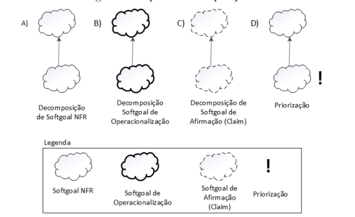
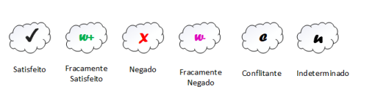
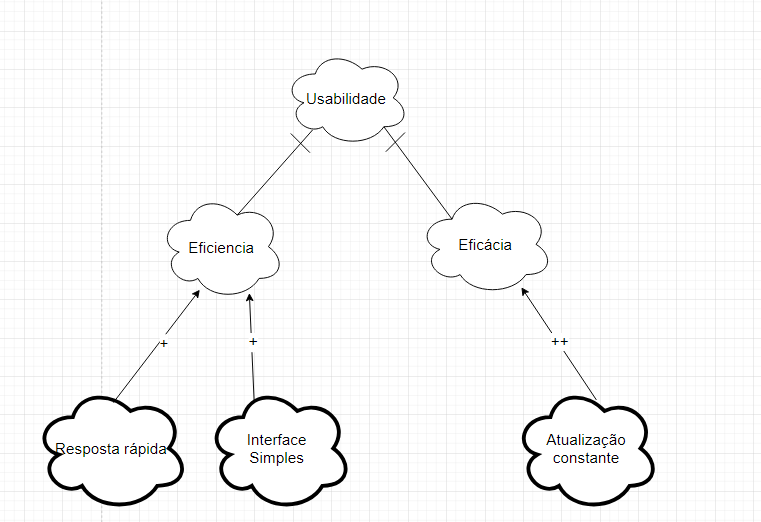
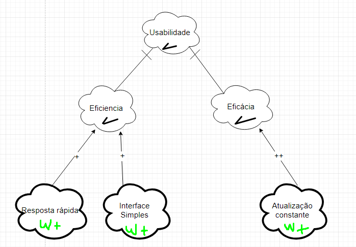
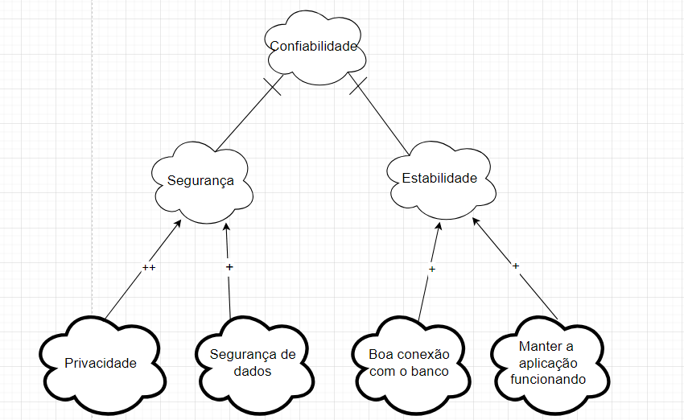
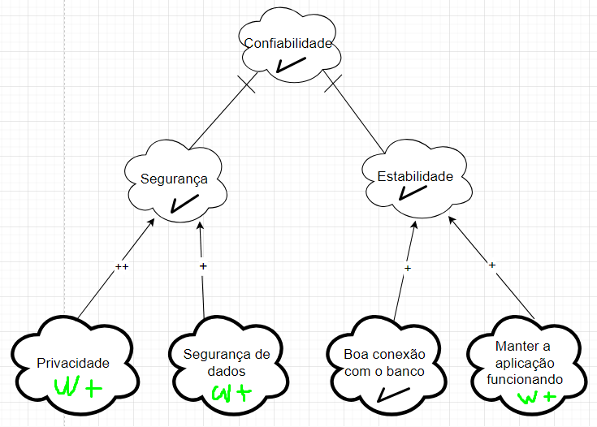
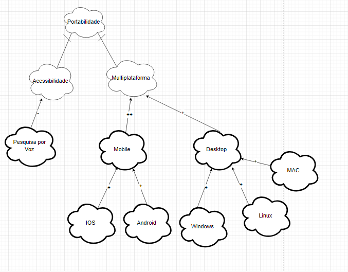
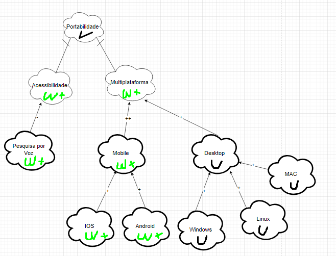

## Introdução

O NFR Framework é uma ferramenta valiosa para representar e analisar Requisitos Não-Funcionais, com foco na implementação de resoluções específicas. Esse framework considera as características gerais do sistema e seu domínio para realizar essa tarefa. No NFR Framework, utiliza-se o modelo Softgoal Interdependency Graph (SIG) para facilitar a visualização e a interdependência dos requisitos.

### Tipos de Softgoal
Existem três categorias de softgoals conhecidas como: Softgoals NFR, Softgoals de Operacionalização e Softgoals de Afirmação. Cada uma delas é explicada a seguir:

**Softgoals NFR:** representam os Requisitos Não-Funcionais e podem ser interconectados. Eles são organizados em catálogos e apresentados de forma hierárquica durante o desenvolvimento do projeto (CHUNG et al., 2000).

**Softgoals de Operacionalização:** representações de soluções de implementação destinadas a atender aos softgoals NFR ou a outros softgoals de operacionalização. Essas soluções englobam operações, processos, representações de dados, estruturação e restrições no sistema-alvo, com o objetivo de atender às necessidades indicadas pelos softgoals NFR e de operacionalização (CHUNG et al., 2000).

**Softgoals de Afirmação:** permitem que as características do domínio, como prioridades e carga de trabalho, sejam consideradas e adequadamente incorporadas ao processo de tomada de decisão. Eles servem como justificativas para apoiar ou contestar a forma como os softgoals são priorizados, refinados e os componentes são selecionados. Os softgoals de afirmação oferecem razões para as decisões de desenvolvimento, tornando mais fácil a revisão, a justificação e a modificação do sistema, bem como a melhoria da rastreabilidade (CHUNG et al., 2000).

<b>Figura 1</b> - Tipos de Softgoal

 Fonte: (SILVA, 2019)

### Interdependências

As interdependências são definições para as associações que ocorrem entre softgoals. Tais são divididas em decomposições e contribuições:

#### Decomposições

As decomposições podem ocorrer em todos os níveis de abstração: Softgoals de NFR, de Operacionalização e de Afirmação. Nas três primeiras decomposições, os softgoals são subdivididos em softgoals especificados (SILVA, 2019). Os quatro tipos estão explicitados na figura 2.

- Decomposição NFR: ajuda a dividir vicissitudes primordiais em partes menores, o que reduz as ambiguidades e facilita a priorização.
- Decomposição de Operacionalização: tem por finalidade refinar uma solução geral em soluções particulares.
- Decomposição de Afirmação: serve como afirmação ou negação de justificativas específicas do projeto.
- Decomposição de Priorização: trata-se de uma decomposição especial, na qual o softgoal é refinado em outro softgoal de mesmo tipo e tópico. No entanto, associa-se uma prioridade.

<b>Figura 2</b> - Tipos de Decomposição

 Fonte: (SILVA, 2019)

#### Contribuições

Num NFR Framework, os softgoals se especializam cada vez mais. Por conseguinte, o um softgoal derivado de outro pode contribuir de forma integral ou truncada, e também de forma positiva ou negativa, para o softgoal do qual ele derivou. Portanto, listar-se-á os tipos de contribuição.

- AND: se os softgoals derivados forem satisfeitos, o softgoal primordial também será.
- OR: se algum dos softgoals derivados forem satisfeitos, o softgoal primordial também será.
- MAKE(++): um softgoal originado contribui de forma plenamente positiva, logo o softgoal original também será satisfeito.
- BREAK(--): um softgoal originado contribui de forma plenamente negativa, logo o softgoal original será negado.
- HELP(+): um softgoal originado realiza uma contribuição restritamente positiva, o que reflete da mesma forma e na mesma intensidade no softgoal primordial.
- HURT(-): um softgoal originado realiza uma contribuição restritamente negativa, o que reflete da mesma forma e na mesma intensidade no softgoal primordial.
- UNKNOWN(?): contribuição incógnita.
- EQUALS: relação direta entre as satisfações do softgoal derivado e a do primordial.
- SOME: a forma de contribuição é conhecida, no entanto, a intensidade dessa contribuição é desconhecida.

#### Propagação de Impactos

A propagação de impactos no NFR Framework  envolve a identificação das relações de dependência entre os requisitos não funcionais, bem como a análise de como uma mudança em um requisito pode afetar outros requisitos relacionados. Isso requer uma compreensão clara das interações entre os requisitos, bem como a capacidade de avaliar as prioridades e trade-offs entre eles. Ao considerar a propagação de impactos, os engenheiros de requisitos podem tomar decisões informadas sobre mudanças e gerenciar os possíveis efeitos colaterais de forma eficaz. A seguir são apresentados os tipos de softgoals de impacto e suas respectivas notações:

<b>Figura 3</b> - Tipos de Propagação

    

 Fonte: (SILVA, 2019)

- ✓ (satisfeito): Indica que um requisito não funcional contribui positivamente para a satisfação de outro requisito.
- 𝒲+ (fracamente satisfeito): indica uma relação de impacto positiva, mas menos forte do que a notação ✓.
- X (negado): Indica que um requisito não funcional afeta negativamente outro requisito, negando ou contradizendo sua realização. 
- 𝒲- (fracamente negado): Similar à notação X, mas com uma relação de negação mais fraca. 
- e (conflitante): Indica uma relação de conflito entre requisitos não funcionais. Isso significa que os requisitos possuem características positivas e negativas.
- u (indeterminado): Uma relação indeterminada ou desconhecida entre requisitos não funcionais. Isso ocorre quando não há informações suficientes para determinar o impacto de um requisito em outro.

## NFR 01 - Usabilidade

<b>Tabela 1</b> - Cartão de Especificação 1

| Tópico | Informação |
|------------| ------------|
| Descrição | Usabilidade refere-se à capacidade do sistema de entregar uma boa usabilidade para os usuários do aplicativo do "Sinesp Cidadão". |
| Justificativa| Uma boa Usabilidade é fundamental para garantir que os usuários possam utilizar o aplicativo com eficiência e garantir uma satisfação do usuário, aumentando a acessibilidade e por consequência tendo uma redução de erros.|
| Origem do Requisito| Requisitos elicitados. |
| Critério de Aceitação | O sistema deve ser capaz de ter uma boa eficiência e ser capaz de realizar as ações requisitadas pelo usuário de maneira rápida. |
| Prioridade| Alta |
| Conflitos| Nenhum |
| História| 26/05/2024|

 Autor: [Italo Bruno](https://github.com/italobrunom)

 Autor: [Italo Bruno](https://github.com/italobrunom)

### Propagação dos Impactos - Usabilidade

 Autor: [Italo Bruno](https://github.com/italobrunom)

## NFR 02 - Confiabilidade

<b>Tabela 2</b> - Cartão de Especificação 2

| Tópico | Informação |
|------------| ------------|
| Descrição | Segurança refere-se à capacidade do sistema de entregar uma segurança e privacidade para os usuários do aplicativo do "Sinesp Cidadão". |
| Justificativa| Uma boa Segurança é fundamental para garantir que os usuários possam utilizar o aplicativo de maneira tranquila sem se preocupar com a segurança de seus dados e informações pessoais.|
| Origem do Requisito| Requisitos elicitados. |
| Critério de Aceitação | O sistema deve ser capaz de ter uma boa segurança e ter uma boa privacidade de dados baseado no que o usuário necessitar. |
| Prioridade| Muito Alta |
| Conflitos| Nenhum |
| História| 26/05/2024|

 Autor: [Italo Bruno](https://github.com/italobrunom)

 Autor: [Italo Bruno](https://github.com/italobrunom)

### Propagação dos Impactos - Confiabilidade

 Autor: [Italo Bruno](https://github.com/italobrunom)

## NFR 03 - Portabilidade

<b>Tabela 3</b> - Cartão de Especificação 3

| Tópico | Informação |
|------------| ------------|
| Descrição | Portabilidade refere-se à capacidade do sistema de ser utilizado em vários sistemas diferentes. |
| Justificativa| Uma boa Portabilidade é fundamental para garantir que qualquer usuário possa utilizar o aplicativo, independente do que ele tenha para uso.|
| Origem do Requisito| Requisitos elicitados. |
| Critério de Aceitação | O sistema deve ser capaz de ser utilizado ao menos em android IOS e em computadores Windows, Linux e MAC. |
| Prioridade| Média |
| Conflitos| Nenhum |
| História| 26/05/2024|

 Autor: [Italo Bruno](https://github.com/italobrunom)

 Autor: [Italo Bruno](https://github.com/italobrunom)

### Propagação dos Impactos - Portabilidade

 Autor: [Italo Bruno](https://github.com/italobrunom)

## Bibliografia

> PAIM, F. R. S., CASTRO, J. F. B. Enhancing Data Warehouse Design with the NFR Framework. Centro de Informática UFPE, Recife, 2019. Disponível em: <http://wer.inf.puc-rio.br/WERpapers/artigos/artigos_WER02/paim.pdf>. 

> CHUNG, L., NIXON, B. A., YU, E., MYLOPOULOS, J. Non-functional requirementsin software engineering. Springer Science & Business Media: [S.l.], 2000. v. 5.

## Histórico de Versões
| Versão | Data | Descrição | Autor | Revisor |
| :----: | :--: | :-------: | :---: | :-----: |
| 1.0 | 25/05/2024 | Criação do documento NFR | [Italo Bruno](https://github.com/ItaloBrunoM)  |  |
| 1.1 | 26/05/2024 | Atualização com os cartões de especificação | [Italo Bruno](https://github.com/ItaloBrunoM)  | [Flávio Melo](https://github.com/flavioovatsug) |
| 1.2 | 27/05/2024 | Atualização com os SIG e Propagação | [Italo Bruno](https://github.com/ItaloBrunoM)  | [Flávio Melo](https://github.com/flavioovatsug) |