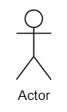
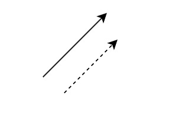
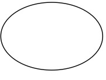
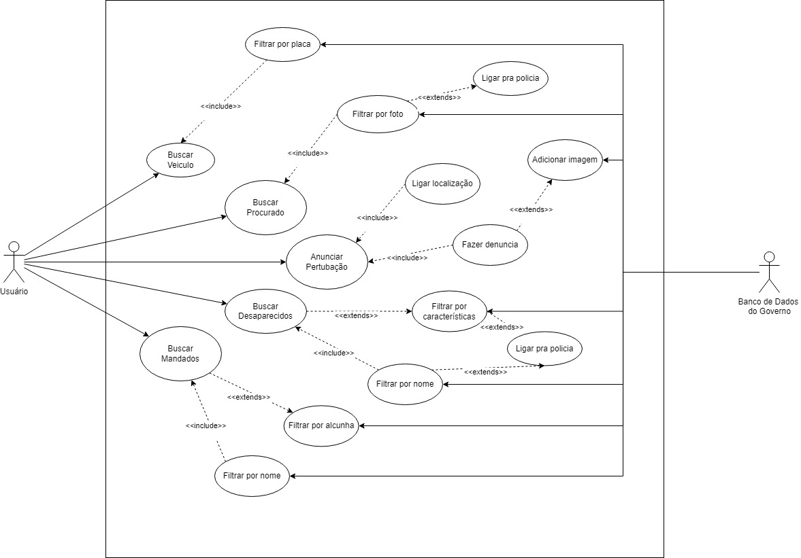

# Casos de Uso

## Introdução

Os casos de uso são uma técnica fundamental na engenharia de software e na análise de sistemas, amplamente utilizada para descrever as interações entre os usuários (atores) e um sistema para alcançar um objetivo específico. Esta técnica é vital para capturar os requisitos funcionais de um sistema, permitindo que desenvolvedores, analistas e stakeholders entendam como um sistema deve se comportar sob várias circunstâncias.

## Metodologia

O diagrama de caso de uso é uma representação visual que resume as interações entre os usuários e um sistema. Para realização dos casos de uso de nosso sistema, utilizaremos da Persona já definida Rogério Barreto, utilizando de suas expectativas, objetivos, tarefas etc, para construção do mesmo. Utilizando dessa técnica é possível montar cenários realistas de uso do sistema Sinesp, mostrando as diferentes funcionalidades suas necessidades e objetivos. A seguir na tabela 1 podem ser vistos os elementos que foram usados no diagrama de casos de uso. 

Tabela 1: Elementos usados no diagram de casos de uso 

| Nome           |Descrição                     |    Representação                           |
|----------------|------------------------------|--------------------------------------------|
| Ator           | Entidade externa que interage com o sistema, podendo ser um usuário ou outro sistema.            |  |
|Retângulo | Representação do sistema por inteiro, delimitando suas fronteiras ||
|Seta| Representações das interações entre atores e usos no sistema||
|Elipse|Representação dos casos de uso. Um caso de uso mostra u,ma funcionalidade ou ação a ser realizada dentro do sistema.||

Autor: [Italo Bruno](https://github.com/ItaloBrunoM) e [Harryson Campos Martins](https://github.com/harry-cmartin) 

## Diagrama de Casos de Uso

Na figura 1 pode ser visto o diagrama de casos de uso desenvolvido.

Figura 1: Diagrama de casos de uso 

Autor: [Italo Bruno](https://github.com/ItaloBrunoM) e [Harryson Campos Martins](https://github.com/harry-cmartin)  .

## Casos de Uso

Tabela 2: Buscar veículo

| UC01 |  Buscar Veiculo |
| -: | :- |
| **Atores** | Usuário |
| **Funcionalidade** | O usuário pode fazer uma busca pelo veiculo desaparecido |
| **Pré-condições** | Conexão com a internet, Login no sistema |
| **Ação** | O usuário busca um veiculo  |
| **Fluxo básico** | <ul><li> O usuário acessa o aplicativo.   <ul><li> O usuário acessa a aba veiculo.   <ul><li> O usuário faz a busca pelo veículo   |
| **Fluxos alternativos** | <ul><li> O usuário acessa o aplicativo   <ul><li> O usuário acessa a aba veiculo.   <ul><li> O app solicita a localização do usuário   <ul><li> O usuário seleciona "Sim"   |
| **Fluxos de exceção** | <ul><li> O usuário acessa o aplicativo   <ul><li> O usuário acessa a aba veiculo.   <ul><li>  O usuário faz a busca pelo veículo.   <ul><li> O aplicativo apresenta "Dados Incorretos"    |
| **Pós-condições** |POS01. O usuário tem acesso aos dados sobre o veiculo. |
| **Data da criação** | 17/05/2024 |
| **Rastreabilidade** | [RF01](https://requisitos-de-software.github.io/2024.1-Sinesp_Cidadao/elicitacao/tecnicas/Requisitos_elicitados/), [RF02](https://requisitos-de-software.github.io/2024.1-Sinesp_Cidadao/elicitacao/tecnicas/Requisitos_elicitados/),[RF16](https://requisitos-de-software.github.io/2024.1-Sinesp_Cidadao/elicitacao/tecnicas/Requisitos_elicitados/), [RF17](https://requisitos-de-software.github.io/2024.1-Sinesp_Cidadao/elicitacao/tecnicas/Requisitos_elicitados/) e [RF27](https://requisitos-de-software.github.io/2024.1-Sinesp_Cidadao/elicitacao/tecnicas/Requisitos_elicitados/)|

Autor: [Italo Bruno](https://github.com/ItaloBrunoM)  .

Tabela 3: Buscar desaparecido

| UC02 |  Buscar Desaparecido |
| -: | :- |
| **Atores** | Usuário |
| **Funcionalidade** | O usuário faz uma busca por pessoas desaparecidas.|
| **Pré-condições** | Conexão com a internet, Login no sistema |
| **Ação** | O usuário encontra desaparecidos |
| **Fluxo básico** | <ul><li> O usuário acessa o aplicativo   <ul><li> O usuário acessa a aba desaparecidos    <ul><li> O usuário filtra por faixa etária, região, nome etc  |
| **Fluxos alternativos** | <ul><li> O usuário acessa o aplicativo   <ul><li> O app solicita a localização do usuário   <ul><li> O usuário seleciona "Ok"   |
| **Fluxos de exceção** | <ul><li> O usuário acessa o aplicativo   <ul><li> O suário insere dados incorretos para pesquisa   |
| **Pós-condições** |O usuário tem acesso aos desparecidos buscados através dos filtros |
| **Data da criação** | 17/05/2024 |
| **Rastreabilidade** | [RF05](https://requisitos-de-software.github.io/2024.1-Sinesp_Cidadao/elicitacao/tecnicas/Requisitos_elicitados/) ,[RF20](https://requisitos-de-software.github.io/2024.1-Sinesp_Cidadao/elicitacao/tecnicas/Requisitos_elicitados/), [RF21](https://requisitos-de-software.github.io/2024.1-Sinesp_Cidadao/elicitacao/tecnicas/Requisitos_elicitados/) ,[RF27](https://requisitos-de-software.github.io/2024.1-Sinesp_Cidadao/elicitacao/tecnicas/Requisitos_elicitados/)|

Fonte: [Harryson Campos Martins](https://github.com/harry-cmartin)  .
 

 

Tabela 4: Buscar mandados

| UC03 |  Buscar Mandados|
| -: | :- |
| **Atores** | Usuário |
| **Funcionalidade** | O usuário faz uma busca por mandados.|
| **Pré-condições** | Conexão com a internet, Login no sistema |
| **Ação** | O usuário encontra mandatos |
| **Fluxo básico** | <ul><li> O usuário acessa o aplicativo   <ul><li> O usuário acessa a aba mandados    <ul><li> O usuário filtra por nome  |
| **Fluxos alternativos** | <ul><li> O usuário acessa o aplicativo   <ul><li> O app solicita a localização do usuário   <ul><li> O usuário seleciona "Ok"   |
| **Fluxos de exceção** | <ul><li> O usuário acessa o aplicativo   <ul><li> O suário insere dados incorretos para pesquisa   |
| **Pós-condições** |O usuário tem acesso aos mandados filtrados |
| **Data da criação** | 17/05/2024 |
| **Rastreabilidade** | [RF08](https://requisitos-de-software.github.io/2024.1-Sinesp_Cidadao/elicitacao/tecnicas/Requisitos_elicitados/), [RF09](https://requisitos-de-software.github.io/2024.1-Sinesp_Cidadao/elicitacao/tecnicas/Requisitos_elicitados/), [RF27](https://requisitos-de-software.github.io/2024.1-Sinesp_Cidadao/elicitacao/tecnicas/Requisitos_elicitados/)|

Autor: [Harryson Campos Martins](https://github.com/harry-cmartin)  .

Tabela 5: Buscar Procurado

| UC04 |  Buscar Procurado |
| -: | :- |
| **Atores** | Usuário |
| **Funcionalidade** | O usuário procura uma pessoa procurada |
| **Pré-condições** | Conexão com a internet, Login no sistema |
| **Ação** | O usuário abre a lista de procurado |
| **Fluxo básico** | <ul><li> O usuário acessa o aplicativo.   <ul><li> O usuário acessa a aba procurado.  <ul><li> Faz uma busca de uma pessoa procurada filtrando por foto   <ul><li> O usuário pode ligar para policia |
| **Fluxos alternativos** | <ul><li> O usuário acessa o aplicativo   <ul><li> O usuário acessa a aba procurado.   <ul><li> O aplicativo solicita login GOV    |
| **Fluxos de exceção** | <ul><li> O usuário acessa o aplicativo   <ul><li> O usuário acessa a aba procurado.   <ul><li> Faz uma busca de uma pessoa procurada   <ul><li> O aplicativo apresenta "Dados Incorretos"    |
| **Pós-condições** |POS04. O usuário tem acesso aos dados sobre o procurado. |
| **Data da criação** | 17/05/2024 |
| **Rastreabilidade** | [RF10](https://requisitos-de-software.github.io/2024.1-Sinesp_Cidadao/elicitacao/tecnicas/Requisitos_elicitados/), [RF11](https://requisitos-de-software.github.io/2024.1-Sinesp_Cidadao/elicitacao/tecnicas/Requisitos_elicitados/) e [RF27](https://requisitos-de-software.github.io/2024.1-Sinesp_Cidadao/elicitacao/tecnicas/Requisitos_elicitados/)|

Autor: [Italo Bruno](https://github.com/ItaloBrunoM)  .

Tabela 6: Anunciar pertubação

| UC05 |  Anunciar pertubação|
| -: | :- |
| **Atores** | Usuário |
| **Funcionalidade** | O usuário faz uma participação cidadã e anuncia uma pertubação|
| **Pré-condições** | Conexão com a internet, Login no sistema |
| **Ação** | O usuário encontra mandatos |
| **Fluxo básico** | <ul><li> O usuário acessa o aplicativo   <ul><li> O usuário acessa a aba participação cidadã    <ul><li> O usuário deve ligar a localização do celular   <ul><li> O usuário faz a denuncia   |
| **Fluxos de exceção** | <ul><li> O usuário acessa o aplicativo   <ul><li> O usuário não possui a localização do celular ligada   |
| **Pós-condições** |O usuário consegue fazer a denúncia do ocorrido |
| **Data da criação** | 17/05/2024 |
| **Rastreabilidade** | [RF13](https://requisitos-de-software.github.io/2024.1-Sinesp_Cidadao/elicitacao/tecnicas/Requisitos_elicitados/), [RF18](https://requisitos-de-software.github.io/2024.1-Sinesp_Cidadao/elicitacao/tecnicas/Requisitos_elicitados/), [RF32](https://requisitos-de-software.github.io/2024.1-Sinesp_Cidadao/elicitacao/tecnicas/Requisitos_elicitados/)|

Autor: [Harryson Campos Martins](https://github.com/harry-cmartin)  .

## Bibliografia

Draw.io. Diagrama de Caso de Uso UML. Disponível em: https://app.diagrams.net/ Acesso em: 16 de maio de 2024

BARBOSA, S. D. J.; SILVA, B. S. Interação Humano-Computador. Rio de Janeiro: Elsevier, 2011.

Bilheteria Digital. Caso de Uso. Repositório da disciplina de Requisitos de Software da Universidade de Brasília, 2023.Disponível em https://requisitos-de-software.github.io/2023.1-BilheteriaDigital/modelagem/useCase/.

## Histórico de Versões
| Versão | Data | Descrição | Autor | Revisor |
| :----: | :--: | :-------: | :---: | :-----: |
| 1.0 | 17/05/2024 | Criação do documento de casos de uso | [Italo Bruno](https://github.com/ItaloBrunoM) e [Harryson Campos Martins](https://github.com/harry-cmartin)|[Christian Hirsch Santos](https://github.com/crstyhs)  |
| 1.1 | 24/05/2024 | Correção do documento e do diagrama | [Italo Bruno](https://github.com/ItaloBrunoM) | [Flávio Melo](https://github.com/flavioovatsug) |