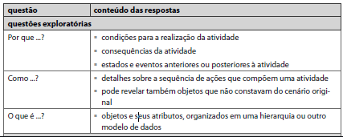
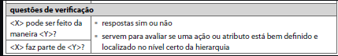

# Cenários

## Introdução

Os cenários são basicamente histórias sobre pessoas realizando uma atividade. Como forma de elaborar cenários mais completos, utilizamos a técnica do **questionamento sistemático**. Nessa técnica, segmentamos os cenários em proposições e investigamos cada uma delas, a partir de um conjunto de perguntas, que as respostam geram mais proposições. Repetimos esse ciclo até que tudo esteja completo. As perguntas sugeridas são: Por quê? Como? O que é? X pode ser feito da forma y? X faz parte de y? Conforme podemos ver nas Figuras 1 e 2.

### Questões exploratórias

Figura 1: Questões exploratórias 

Fonte: Barbosa, S., & Silva, B. (Ano de Publicação). Interação Humano-Computador (3ª ed.). Editora.

### Questões de verificação

Figura 2: Questões de verificação 

Fonte: Barbosa, S., & Silva, B. (Ano de Publicação). Interação Humano-Computador (3ª ed.). Editora.

## Cenários

Segundo Cooper, 1999, Rosson e Carroll, 2002, os cenários não precisam ser criados somente após a definição das personas e podem ser realizados em diversas etapas do processo, visando diferentes objetivos. Neste caso, decidimos usar os cenários como forma de auxiliar a equipe a fazer a identificação das personas e onde cada uma delas está inserido, sendo usados também como instrumento de elicitação de requisitos. 

## Estrutura do Cenário
Abaixo o modelo seguido para elaboração dos cenários na tabela 1

Tabela 1: Modelo estrutura dos cenários

  
| identificador do cenário   | Descrição |
| -------- | ----------- |
| Título     |   Descreve o tema central do cenário e seu foco principal.   |
| Objetivo     |   Define o propósito ou a meta que o cenário busca alcançar.  |
| Contexto    |   Fornece detalhes sobre as condições iniciais, o ambiente físico e o momento em que o cenário ocorre.    |
| Atores  |    Indica as pessoas ou organizações envolvidas no cenário.   |
| Recursos |   Lista os objetos ou ferramentas com os quais os atores interagem durante o cenário.   |
| Episódios  |   Narra as ações executadas pelos atores, incluindo a interação com outros atores e o uso dos recursos.    |
| Restrição  |   Identifica limitações ou restrições que possam afetar as ações dentro do cenário.    |
| Exceção  |   Descreve situações excepcionais que podem impedir a conclusão do cenário conforme planejado.    |

  

Autor: <a href="https://github.com/crstyhs">Christian</a>

## Cenários identificados

Tabela 2: Buscar Veiculo 

  
| CN01   | Descrição |
| -------- | ----------- |
| Título     |   Buscar Veiculo   |
| Objetivo     |  Verificar informações sobre um veículo suspeito usando o aplicativo SINESP Cidadão.   |
| Contexto    |  - Local: Rua pouco movimentada    - Tempo: Durante a noite em 2 minutos   - Pré-condição: Acesso a internet  |
| Atores  |    Usuário  |
| Recursos |   Celular , Aplicativo   |
| Episódios  |  - Usuário encontra um veículo suspeito na rua   - Usuário abre e efetua login no aplicativo   - Usuário seleciona VEÍCULO   - Usuário pesquisa por veículo    |
| Restrição  |   Inserção correta cos caracteres da placa    |
| Exceção  |    Placa não encontrada no banco de dados  |

  

Autor: <a href="https://github.com/crstyhs">Christian</a>

Autor: <a href="https://github.com/IanLucca12">Ian Lucca</a>

Tabela 3: Buscar Desaparecido 

  
| CN02   | Descrição |
| -------- | ----------- |
| Título     |   Buscar Desaparecido   |
| Objetivo     |   Localizar informações sobre uma pessoa desaparecida usando o aplicativo SINESP Cidadão  |
| Contexto    |  - Local: Praça pública   - Tempo: Durante a tarde, cerca de 2 minutos   - Pré-condição: Acesso à internet   |
| Atores  |    Usuário  |
| Recursos |   Celular , Aplicativo   |
| Episódios  | - Usuário encontra encontra alguém parecido com algum parente de um amigo   - Usuário abre e efetua login no aplicativo   - Usuário seleciona DESAPARECIDOS   - Usuário busca por desaparecido  |
| Restrição  |   Precisão e atualização dos dados no banco de dados do aplicativo    |
| Exceção  |   Dados da pessoa desaparecida não encontrados ou incompletos no banco de dados   |

Autor: <a href="https://github.com/Bittarx">Marcos Bittar</a>

  

Tabela 4: Buscar Mandados 

  
| CN03   | Descrição |
| -------- | ----------- |
| Título     |   Buscar Mandados   |
| Objetivo     |   Verificar informações sobre mandados de prisão ativos usando o aplicativo SINESP Cidadão  |
| Contexto    |  - Local: Agencia de Advocacia   - Tempo: Durante o expediente, cerca de 2 minutos   - Pré-condição: Acesso à internet |
| Atores  |    Usuário  |
| Recursos |   Celular , Aplicativo   |
| Episódios  |  - Usuário precisa saber se uma pessoa possui mandados   - Usuário abre e efetua login no aplicativo   - Usuário seleciona MANDADOS   - Usuário busca por pessoa   |
| Restrição  |  Disponibilidade de rede móvel estável e precisão dos dados no banco de dados do aplicativo   |
| Exceção  |  Mandado não encontrado ou dados do mandado desatualizados no banco de dados   |

  

Autor: <a href="https://github.com/flavioovatsug">Flávio Melo</a>

Tabela 5: Buscar Procurado 

  
| CN04   | Descrição |
| -------- | ----------- |
| Título     |   Buscar Procurado   |
| Objetivo     |   Localizar informações sobre pessoas procuradas pela justiça usando o aplicativo SINESP Cidadão.  |
| Contexto    | - Local: Qualquer lugar com acesso à internet   - Tempo: 2 minutos   - Pré-condição: Acesso à internet |
| Atores  |    Usuário  |
| Recursos |   Celular , Aplicativo   |
| Episódios  |  -Usuário deteve uma pessoa suspeita    - Usuário abre e efetua login no aplicativo   - Usuário seleciona PROCURADOS   - Usuário identifica procurado   |
| Restrição  |    Disponibilidade de rede móvel estável e precisão dos dados no banco de dados do aplicativo   |
| Exceção  |   Informações sobre pessoas procuradas não encontradas ou dados desatualizados no banco de dados   |

Autor: <a href="https://github.com/ItaloBrunoM">Italo Bruno</a>

Tabela 6: Anunciar pertubação 

  
| CN05   | Descrição |
| -------- | ----------- |
| Título     |   Anunciar pertubação   |
| Objetivo     | Alertar as autoridades sobre uma situação de perturbação da ordem pública usando o aplicativo SINESP Cidadão.  |
| Contexto    |  - Local: Localização onde ocorre a perturbação   - Tempo: Momento em que a perturbação está ocorrendo   - Pré-condição: Acesso à internet |
| Atores  |    Usuário  |
| Recursos |   Celular , Aplicativo   |
| Episódios  |  - Usuário identifica uma perturbação na vizinhança   	- Usuário abre o aplicativo SINESP Cidadão   - Usuário seleciona a opção "PARTICIPAÇÃO CIDADÃ"   - Usuário descreve a situação de perturbação, incluindo detalhes relevantes   - Aplicativo envia o alerta para as autoridades competentes  |
| Restrição  |  Necessidade de uma conexão de internet estável e precisa descrição da situação de perturbação    |
| Exceção  |   Falta de resposta imediata das autoridades ou incapacidade de envio do alerta devido a problemas técnicos |

  

Autor: <a href="https://github.com/harry-cmartin">Harryson Martins</a>

  

## Bibliografia 

>  BARBOSA, S. D. J.; SILVA, B. S. Interação Humano-Computador. Rio de Janeiro: Elsevier, 2010.

## Histórico de versões

| Versão | Data       | Descrição            | Autor(es)                                                                                              | Revisor(es)                                    |
| ------ | ---------- | -------------------- | ------------------------------------------------------------------------------------------------------ | ---------------------------------------------- |
| 1.0   | 03/05/2024 | Correção de erros    | [Harryson Martins](https://github.com/harry-cmartin) |  [Christian Hirsch Santos](https://github.com/crstyhs)    |
| 1.1   | 19/05/2024 | Correção de erros e modificação da estrutura    | [Christian Hirsch Santos](https://github.com/crstyhs) | [Flávio Melo](https://github.com/flavioovatsug) |
| 1.2   | 29/06/2024 | Correção de erros e modificação de nomes    | [Flávio Melo](https://github.com/flavioovatsug) |[Christian Hirsch Santos](https://github.com/crstyhs) |
