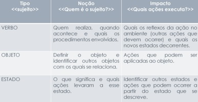

# Léxico

## Introdução
Este documento refere-se ao Léxico, documentação exigida sobre Modelagem no projeto de requisitos de software pelo grupo 5 para definir os termos essenciais e suas relações no domínio da aplicação, ajudando a criar um vocabulário comum e claro entre todos os envolvidos no projeto aplicativo Sinesp Cidadão 

## Metodologia
A metodologia usada foi a LAL - Léxico Ampliado da Linguagem , trata-se de uma técnica que procura descrever os símbolos de uma
linguagem com o objetivo de identificar palavras ou frases pecuííares do meio social da
aplicação sob estudo.[1] 

## Estrutura do dicionário
Abaixo os modelos seguidos para elaboração do dicionário

Figura 1: Regras por tipo 

Fonte: SERRANO M.; SERRANO M. Requisitos - Aula 10.

Tabela 1 - Estrutura do dicionário

  
| identificador do léxico   | Descrição |
| -------- | ----------- |
| Léxico     | Nome do léxico     |
| Tipo     | Dividido em VERBO , OBJETO , ESTADO     |
| Noção    | Quem é o sujeito, relativo ao seu tipo      |
| Impacto  | Ações executada , relativo ao seu tipo      |
| Sinônimo | Palavras com mesmo ou parecido significado     |
| Ligação  | Ligação entre os léxicos      |

  

Fonte: <a href="https://github.com/crstyhs">Christian</a>

## Léxicos identificados

Tabela 2 - Estrutura do dicionário

  
| LX01   | Descrição |
| -------- | ----------- |
| Léxico     | Usuário     |
| Tipo     | OBJETO    |
| Noção    | Pessoa que utiliza o aplicativo Sinesp Cidadão para realizar <a href = "#consulta">consultas</a> e <a href = "#interação">interações</a>      |
| Impacto  | Ações realizadas pelo <a href = "#usuário">usuário</a>  no aplicativo, como <a href = "#login">login</a>, <a href = "#consulta">consulta</a> de informações, etc.      |
| Sinônimo | Cidadão, Utilizador     |
| Ligação  | <a href = "#login">Login</a>, <a href = "#consultar">Consultar</a>, <a href = "#interação">Interação</a>      |

  

Fonte: 

Tabela 3 - Estrutura do dicionário

  
| LX02   | Descrição |
| -------- | ----------- |
| Léxico     | Interação     |
| Tipo     | OBJETO    |
| Noção    | Troca de informações ou <a href = "#consultar">consultas</a> entre o <a href = "#usuário">usuário</a> e o aplicativo Sinesp Cidadão      |
| Impacto  | Afeta a experiência do usuário e o funcionamento do sistema      |
| Sinônimo | Intercâmbio, Comunicação     |
| Ligação  |<a href = "#usuário">Usuário</a>, <a href = "#Consultar">consultar</a>     |

  

Fonte: <a href="https://github.com/crstyhs">Christian</a>

Tabela 4 - Estrutura do dicionário

  
| LX03   | Descrição |
| -------- | ----------- |
| Léxico     | Mandado     |
| Tipo     | OBJETO  |
| Noção    | Documento ou ordem escrita que contém instruções ou comandos a serem seguidos      |
| Impacto  | <a href = "#Consultar">consultar</a> <a href = "#mandado">mandados</a> mandados     |
| Sinônimo | Ordem, Comando     |
| Ligação  | <a href = "#Consultar">Consultar</a>      |

  

Fonte: 

Tabela 5 - Estrutura do dicionário

  
| LX04   | Descrição |
| -------- | ----------- |
| Léxico     | Mercosul     |
| Tipo     | OBJETO    |
| Noção    | Bloco econômico formado por países da América do Sul, com o objetivo de promover a integração econômica e política na região     |
| Impacto  | Tipo de placa para <a href = "#Consultar">consultar</a>  informações de veículo     |
| Sinônimo | Mercado Comum do Sul     |
| Ligação  |    <a href = "#Consultar">Consultar</a>    |

  

Fonte: <a href="https://github.com/crstyhs">Christian</a>

Tabela 6 - Estrutura do dicionário

  
| LX05   | Descrição |
| -------- | ----------- |
| Léxico     | Vínculo     |
| Tipo     | OBJETO    |
| Noção    | Relação estabelecida entre dois ou mais elementos, indicando conexão, associação ou interdependência entre eles     |
| Impacto  | vínculos estabelecidos entre <a href = "#usuário">usuário</a> e veículo <a href = "#furtado">furtado</a> ou roubado e <a href = "#desaparecido">desaparecido</a>      |
| Sinônimo | Ligação, Conexão    |
| Ligação  | <a href = "#usuário">Usuário</a> , <a href = "#furtado">Furtado</a> , <a href = "#desaparecido">Desaparecido</a>     |

  

Fonte: 

Tabela 7 - Estrutura do dicionário

  
| LX06   | Descrição |
| -------- | ----------- |
| Léxico     |  Editar     |
| Tipo     | VERBO     |
| Noção    | O sujeito é o usuário do app, que realiza a ação de editar informações ou dados previamente inseridos ou <a href = "#registrado"> Registrado</a> no sistema do Sinesp Cidadão.      |
| Impacto  | A ação de editar permite ao usuário atualizar, corrigir ou modificar informações para garantir a precisão e relevância dos dados no sistema, como alterar detalhes de um registro de veículo ou corrigir informações pessoais.      |
| Sinônimo | Modificar, alterar, corrigir, atualizar     |
| Ligação  | <a href = "#registrado"> Registrado</a>      |

  

Fonte: <a href="https://github.com/crstyhs">Christian</a>

Tabela 8 - Estrutura do dicionário

  
| LX07   | Descrição |
| -------- | ----------- |
| Léxico     | Login     |
| Tipo     | VERBO    |
| Noção    | O sujeito é o usuário do app, que realiza o login para acessar as funcionalidades e informações disponíveis no Sinesp Cidadão.     |
| Impacto  | A ação de login permite ao <a href = "#usuário">Usuário </a> acessar e utilizar os recursos do app, como<a href = "#consulta"> Consultar </a>  dados sobre veículos, mandados de prisão, e pessoas desaparecidas.      |
| Sinônimo | Entrar, autenticar, acessar, logar    |
| Ligação  |<a href = "#usuário">Usuário </a> , <a href = "#consulta"> Consultar </a>     |

  

Fonte: Ian Lucca

Tabela 9 - Estrutura do dicionário

  
| LX08   | Descrição |
| -------- | ----------- |
| Léxico     | Filtrar     |
| Tipo     | VERBO    |
| Noção    | O sujeito é o usuário do app, que utiliza a função de filtro para refinar e especificar as informações desejadas, como resultados de <a href = "#consultas"> Consultar </a> de veículos ou pessoas desaparecidas.     |
| Impacto  | A ação de filtrar permite ao usuário refinar os dados apresentados, tornando a busca mais eficiente e direcionada às necessidades específicas do usuário.      |
| Sinônimo | Refinar, selecionar, ajustar, peneirar    |
| Ligação  |<a href = "#consulta"> Consultar </a>     |

  

Fonte: 

Tabela 10 - Estrutura do dicionário

  
| LX09   | Descrição |
| -------- | ----------- |
| Léxico     | Marcar Localização     |
| Tipo     | VERBO    |
| Noção    | O sujeito é o usuário do app, que utiliza a função de marcar localização para registrar um ponto específico no mapa, como a localização de um veículo suspeito ou o avistamento de uma pessoa desaparecida.     |
| Impacto  | A ação de marcar a localização permite ao usuário <a href = "#registrar"> Registrado </a> e compartilhar a posição geográfica de eventos ou observações relevantes, contribuindo para a eficácia das operações de segurança e busca       |
| Sinônimo | Registrar posição, geolocalizar, apontar local, mapear    |
| Ligação  |<a href = "#registrar"> Registrado </a>     |

  

Fonte: 

Tabela 11 - Estrutura do dicionário

  
| LX10   | Descrição |
| -------- | ----------- |
| Léxico     | Consultar     |
| Tipo     |  VERBO    |
| Noção    | O sujeito é o usuário do app, que consulta informações específicas (como veículos, <a href = "#mandados"> Mandados</a> de prisão, e pessoas desaparecidas).     |
| Impacto  | O usuário executa a ação de consulta, o que pode resultar em encontrar informações importantes e úteis para a segurança e auxílio nas investigações.       |
| Sinônimo | Verificar, conferir, checar, buscar    |
| Ligação  |<a href = "#mandados"> Mandados</a>     |

  

Fonte: 

Tabela 12 - Estrutura do dicionário

  
| LX11   | Descrição |
| -------- | ----------- |
| Léxico     | Logado     |
| Tipo     |  ESTADO    |
| Noção    | O sujeito é o usuário do app que está autenticado no sistema, ou seja, realizou com sucesso o login e está em um estado de sessão ativa     |
| Impacto  | Estando logado, o usuário tem acesso a todas as funcionalidades e informações disponíveis no app, como <a href = "#consultar"> Consultar</a> dados sobre veículos, <a href = "#mandados"> Mandados</a> de prisão, e pessoas desaparecidas       |
| Sinônimo | Autenticado, conectado, ativo, com sessão iniciada    |
| Ligação  |<a href = "#consultar"> Consultar</a> dados sobre veículos, <a href = "#mandados"> Mandados</a>     |

  

Fonte: 

Tabela 13 - Estrutura do dicionário

  
| LX12   | Descrição |
| -------- | ----------- |
| Léxico     | Registrado     |
| Tipo     |  ESTADO    |
| Noção    | O sujeito é o <a href = "#usuário">Usuário </a>  do app que completou o processo de registro, ou seja, forneceu os dados necessários e criou uma conta no sistema do Sinesp Cidadão.     |
| Impacto  | Estando registrado, o<a href = "#usuário">Usuário </a>  pode acessar o app com suas credenciais, o que lhe permite realizar ações como <a href = "#login">Login </a> , <a href = "#consulta"> Consultar </a> de informações, e uso de outras funcionalidades específicas do app.      |
| Sinônimo | Inscrito, cadastrado, autenticado, incluído    |
| Ligação | <a href = "#usuário">Usuário </a> , <a href = "#login">Login </a> , <a href = "#consulta"> Consultar </a>     |

  

Fonte: Ian Lucca

Tabela 14 - Estrutura do dicionário

  
| LX13   | Descrição |
| -------- | ----------- |
| Léxico     | Desaparecido     |
| Tipo     |  ESTADO    |
| Noção    | O sujeito é a pessoa que está desaparecida e cuja informação está <a href = "#registrada"> Registrado </a> no sistema do Sinesp Cidadão.     |
| Impacto  |  Estando desaparecido, a ação executada é a busca e localização dessa pessoa, envolvendo esforços de autoridades e da comunidade para encontrá-la e garantir sua segurança.      |
| Sinônimo | Perdido, sumido, ausente, desaparelhado    |
| Ligação  | <a href = "#registrada"> Registrado </a>     |

  

Fonte: Ian Lucca

Tabela 15 - Estrutura do dicionário

  
| LX14   | Descrição |
| -------- | ----------- |
| Léxico     | Furtado     |
| Tipo     |  ESTADO    |
| Noção    | Condição em que um veículo foi ilegalmente tirado ou roubado de seu legítimo proprietário     |
| Impacto  |  Condição do veículo perante <a href = "#consultar"> consulta</a>      |
| Sinônimo | Roubado, Subtraído    |
| Ligação  | <a href = "#consultar"> Consultar</a>     |

  

Fonte: Italo Bruno

Tabela 16 - Estrutura do dicionário

  
| LX15   | Descrição |
| -------- | ----------- |
| Léxico     | Obrigatório     |
| Tipo     |  ESTADO    |
| Noção    | Condição em que algo deve ser feito ou seguido, sem opção de escolha     |
| Impacto  |  Preenchimento de dados em campos para busca de <a href = "#desaparecido"> desaparecido </a>      |
| Sinônimo | Mandatório, Necessário    |
| Ligação  | <a href = "#desaparecido"> Desaparecido </a>     |

  

Fonte: 

## Referências
[1] SALES, André Barros. Plano de ensino da disciplina. Disponível em: <https://aprender3.unb.br/pluginfile.php/2844903/mod_resource/content/40/Plano_de_Ensino%20RE%20012024%20Turma%201.pdf>. Acesso em 17 de Maio de 2024. 
[2] SERRANO, Milene; SERRANO, Maurício. Slides de Requisitos. Disponível em: <https://aprender3.unb.br/pluginfile.php/2845027/mod_resource/content/1/Aula%2010.pdf>. Acesso em 17 de Maio de 2024.

## Histórico de Versões
| Versão | Data | Descrição | Autor | Revisor |
| :----: | :--: | :-------: | :---: | :-----: |
| 1.0 | 17/05/2024 | Criação do documento do Lexico | [Christian](https://github.com/crstyhs)| |
