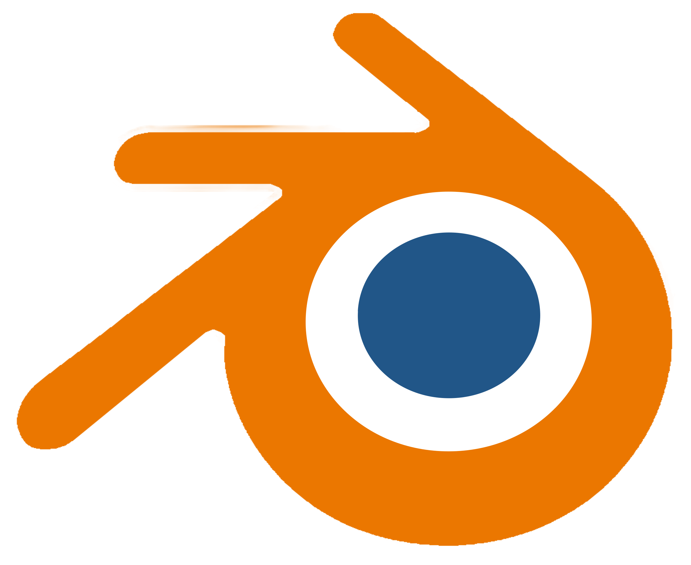
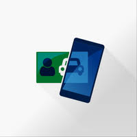

# Lista de aplicativos

Conjunto de aplicativos elicitados para análise com o objetivo de selecionar um entre eles para estudo e o seguimento do projeto

## Lista de Aplicativos Sugeridos

A tabela 1 apresenta os aplicativos sugeridos por cada membro do grupo durante a fase de pré-rastreabilidade.

|          Integrante           |                                        Nome do Aplicativo                                         |                                                                                      Descrição                                                                                       |                                Logo                                |  
| :---------------------------: | :-----------------------------------------------------------------------------------------------: | :----------------------------------------------------------------------------------------------------------------------------------------------------------------------------------: | :----------------------------------------------------------------: | 
|           Christian Hirsch Santos           |       [e-Título](https://play.google.com/store/apps/details?id=br.jus.tse.eleitoral.etitulo&hl=pt_BR&gl=US&pli=1)   [1]        |                                             O e-Título é a via digital do título de eleitor. Com ele, é possível ter acesso fácil e rápido às informações pessoais na Justiça Eleitoral.                                            |     |                                            
|       Flávio Gustavo Araújo de Melo        |                       [Declara Água](https://play.google.com/store/apps/details?id=br.gov.ana.declaraagua&hl=pt_BR&gl=US)          [2]                      |                                 O aplicativo Declara Água é uma ferramenta simples para o usuário de recursos hídricos monitorar e acompanhar o seu uso da água e se conectar com o órgão gestor de recursos hídricos                                   |  | 
|       Flávio Gustavo Araújo de Melo        |                               [Sinesp Cidadão](https://play.google.com/store/apps/details?id=br.gov.sinesp.cidadao.android&hl=pt_BR&gl=US)[3]                   |                                Aplicativo do Sistema Nacional de Informações de Segurança Pública que permite ao cidadão consultas sobre veículos, mandados de prisão e desaparecidos.                                 |  |                                       
|        Harryson Campos Martins         | [Detran-DF](https://play.google.com/store/apps/details?id=br.com.mesotec.detrandf&hl=pt_BR&gl=US)  [4]  | O aplicativo serve para fornecer aos motoristas e proprietários de veículos do Distrito Federal uma série de funcionalidades relacionadas à documentação e aos serviços de trânsito. |  | 
| Ian Lucca Soares Mesquita | [Meu SUS Digital](https://play.google.com/store/apps/details?id=br.gov.datasus.cnsdigital&hl=pt_BR&gl=US)[5] |Promove o acesso às informações em saúde, promovendo a continuidade do cuidado, a transparência. |  | 
| Italo Bruno Avelino da Silva Melo | [Blender](https://www.blender.org) [6] |Blender é um software de código aberto para modelagem, animação, texturização, composição e renderização de imagens e vídeos em 3D.|  |
| Marcos Santos Bittar | [IBGE](https://play.google.com/store/apps/details?id=br.gov.ibge&hl=pt_BR&gl=US)  [7]  | O objetivo do aplicativo é a disseminação das informações de indicadores econômicos, dados censitários, índices de preços e notícias das atividades da instituição |  | 
| Marcos Santos Bittar | [Carteira Digital de Trânsito](https://play.google.com/store/apps/details?id=br.gov.serpro.cnhe&hl=pt_BR&gl=US)  [8]  | O aplicativo permite o download  da Carteira Nacional de Habilitação - CNH,a versão digital do Certificado de Registro e Licenciamento de Veículo – CRLV (Documento do Veículo). |  |

  
 Tabela 1: Tabela de aplicativos sugeridos.

## Aplicativo Escolhido

 Posteriormente a primeira reunião de grupo foi decido que entre as opções sugeridas o aplicativo escolhido seria o <i>sinesp cidadão</i>

## Referências

[1] e-Título. Disponível em: [Google Play](https://play.google.com/store/apps/details?id=br.jus.tse.eleitoral.etitulo&hl=pt_BR&gl=US&pli=1). Acesso em: 27 de Março de 2024. 
[2] Declara Água. Disponível em: [Google Play](https://play.google.com/store/apps/details?id=br.gov.ana.declaraagua&hl=pt_BR&gl=US). Acesso em: 27 de Março de 2024. 
[3] Sinesp Cidadão. Disponível em: [Gov](https://www.gov.br/pt-br/apps/sinesp-cidadao).  Acesso em: 27 de Março de 2024. 
[4] DETRAN-DF. Disponível em: [Google Play](https://play.google.com/store/apps/details?id=br.com.mesotec.detrandf&hl=pt_BR&gl=US). Acesso em: 27 de Março de 2024. 
[5] Meu SUS Digital. Disponível em: [Google Play](https://play.google.com/store/apps/details?id=br.gov.datasus.cnsdigital&hl=pt_BR&gl=US). Acesso em: 27 de Março de 2024. 
[6] Blender. Disponivel em: [Blender](https://www.blender.org). Acesso em:27 de Março de 2024  
[7] IBGE. Disponível em: [Google Play](https://play.google.com/store/apps/details?id=br.gov.ibge&hl=pt_BR&gl=US). Acesso em: 27 de Março de 2024. 
[8] Carteira Digital de Trânsito. Disponível em: [Google Play](https://play.google.com/store/apps/details?id=br.gov.serpro.cnhe&hl=pt_BR&gl=US). Acesso em: 27 de Março de 2024. 

## Histórico de Versão

| Versão | Data de execução |            Descrição             |                      Autor(es)                       |                     Revisor                     |
| :----: | :--------------: | :-------------------------------: | :--------------------------------------------------: | :--------------------------------------------------: |
| `1.0`  |    27/03/2024    |    Criação do arquivo da lista de aplicativos |   Christian   |  |
| `1.1`  |    28/03/2024    |    Atualização da Lista |   Italo   | Christian |
