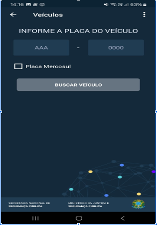
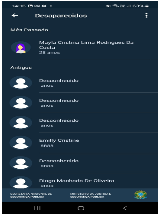
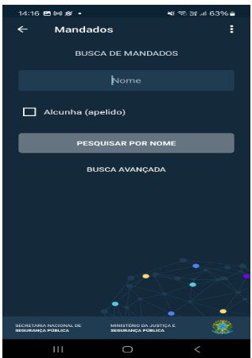
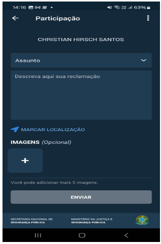
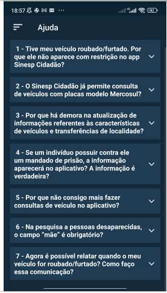
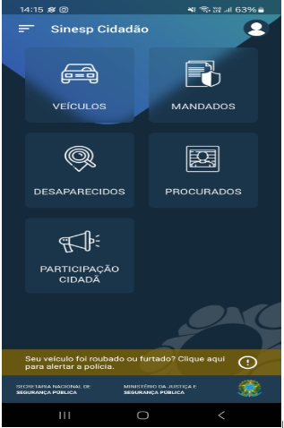
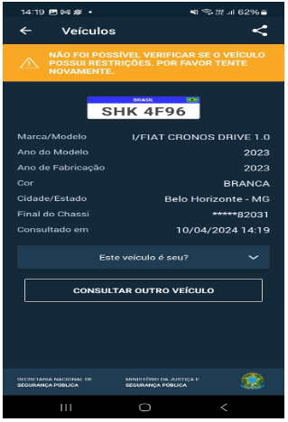

# Forward-From

## Introdução

De acordo com o livro "Requirements Engineering Fundamentals" de Klaus Pohl e Chris Rupp, rastreabilidade
de requisitos é a capacidade de traçar rastros de requisitos durante toda a vida de um software. A técnica Forward-from tem por objetivo ligar os requisitos presentes a artefatos de desenho/protótipo ou implementação.

Logo, para esse dicumento, a intenção é aplicar a técnica de Forward-from nos [requisitos elicitados](https://requisitos-de-software.github.io/2024.1-Sinesp_Cidadao/elicitacao/tecnicas/Requisitos_elicitados/) do app Sinesp.

## Metodologia

Para aplicação dessa técinica foi planejado o relacionamento de cada requsto com sua respectiva história de usuário, léxico, tema ou épico e cenário presente. Além disso para os requistos funcionais e implemntados será mostrada a implementação no app, já para os não funcionais serão relacionados ao NFR respectivo, Especificação Suplementar e onde for obtido.

## Mapeamento

Os símbolos abaixo representa os símbolos para mapeamento:

Tabela 1: Símbolos

  | Legenda | Artefato |
  | ------- | ------------------------- |
  | AI| Análise de interface |
  | C | Cenários |
  | EP | Épico |
  |TM |Tema |
  | ENT | Entrevista |
  | ES | Especificação Suplementar |
  | AD | Analise de Documento |
  | INT | Introspecção |
  | LX | Léxico |
  | AP | Análise de Protocolo |
  | Q | Questionário |
  | RF | Requisitos Funcionais |
  | RNF | Requisitos não Funcionais |
  | ST | Storytelling |
  | UC | Casos de Uso |
  | US | Histórias de usuário |
  
_Autor:[Harryson Campos Martins](https://github.com/harry-cmartin), 2024._

Nas tabelas 2 a 30 a seguir podem ser vistas a aplicação da técnica em cada requisitos funcional implementado:

Tabela 2: RF01 - Logar pelo Gov

| Legenda | Referência |
| ------- | ------------------------- |
| Épico | EP01 |
|  Tema| TM02 |
|História de usuário | HU01 |
| Elicitação | [AIU2](https://requisitos-de-software.github.io/2024.1-Sinesp_Cidadao/elicitacao/tecnicas/AnaliseDaInterface/) , [IP2](https://requisitos-de-software.github.io/2024.1-Sinesp_Cidadao/elicitacao/tecnicas/Introspeccao/), [DOC10](https://requisitos-de-software.github.io/2024.1-Sinesp_Cidadao/elicitacao/tecnicas/AnaliseDeDocumento/) |
| Caso de uso| |
| Cenário| Todos os cénarios |
| Léxico | LX07 |
|Implementação| |

_Autor:[Harryson Campos Martins](https://github.com/harry-cmartin), 2024._

Tabela 2 : RF02 - Buscar por veículo

| Legenda | Referência |
| ------- | ------------------------- |
| Épico | EP02 |
|  Tema| TM01 |
|História de usuário | HU02 |
| Elicitação | [AIU4](https://requisitos-de-software.github.io/2024.1-Sinesp_Cidadao/elicitacao/tecnicas/AnaliseDaInterface/), [IP4](https://requisitos-de-software.github.io/2024.1-Sinesp_Cidadao/elicitacao/tecnicas/Introspeccao/) |
| Caso de uso| UC01 |
| Cenário| Todos os cénarios |
| Léxico | LX08 |
|Implementação| |

_Autor:[Harryson Campos Martins](https://github.com/harry-cmartin), 2024._

Tabela 3 : RF03 - Informar dados do veículo

| Legenda | Referência |
| ------- | ------------------------- |
| Épico | EP02 |
|  Tema| TM01 |
|História de usuário | HU03 |
| Elicitação | [AIU5](https://requisitos-de-software.github.io/2024.1-Sinesp_Cidadao/elicitacao/tecnicas/AnaliseDaInterface/), [IP5](https://requisitos-de-software.github.io/2024.1-Sinesp_Cidadao/elicitacao/tecnicas/Introspeccao/), [DOC1](https://requisitos-de-software.github.io/2024.1-Sinesp_Cidadao/elicitacao/tecnicas/AnaliseDeDocumento/) |
| Caso de uso| UC01 |
| Cenário| Todos os cénarios |
| Léxico | LX10 |
|Implementação||

_Autor:[Harryson Campos Martins](https://github.com/harry-cmartin), 2024._

Tabela 4 : RF04	- Adicionar carro como roubado

| Legenda | Referência |
| ------- | ------------------------- |
| Épico | EP03 |
|  Tema| TM01 |
|História de usuário | HU03 |
| Elicitação |  [AIU6](https://requisitos-de-software.github.io/2024.1-Sinesp_Cidadao/elicitacao/tecnicas/AnaliseDaInterface/), [IP6](https://requisitos-de-software.github.io/2024.1-Sinesp_Cidadao/elicitacao/tecnicas/Introspeccao/) |
| Caso de uso| - |
| Cenário| Todos os cénarios |
| Léxico | LX05 |
|Implementação||

_Autor:[Harryson Campos Martins](https://github.com/harry-cmartin), 2024._

Tabela 5 : RF05 - Listar pessoas desaparecidas

| Legenda | Referência |
| ------- | ------------------------- |
| Épico | EP02 |
|  Tema| TM01 |
|História de usuário | HU04 |
| Elicitação | [AIU9](https://requisitos-de-software.github.io/2024.1-Sinesp_Cidadao/elicitacao/tecnicas/AnaliseDaInterface/), [IP9](https://requisitos-de-software.github.io/2024.1-Sinesp_Cidadao/elicitacao/tecnicas/Introspeccao/) |
| Caso de uso| UC02 |
| Cenário| Todos os cénarios |
| Léxico | LX10 |
|Implementação||

_Autor:[Harryson Campos Martins](https://github.com/harry-cmartin), 2024._

Tabela 6 : RF06 - Vincular ao desaparecido

| Legenda | Referência |
| ------- | ------------------------- |
| Épico | EP03 |
|  Tema| TM01 |
|História de usuário | HU06 |
| Elicitação |  [AIU11](https://requisitos-de-software.github.io/2024.1-Sinesp_Cidadao/elicitacao/tecnicas/AnaliseDaInterface/), [IP11](https://requisitos-de-software.github.io/2024.1-Sinesp_Cidadao/elicitacao/tecnicas/Introspeccao/) |
| Caso de uso| UC02 |
| Cenário| Todos os cénarios |
| Léxico | LX05 |
|Implementação||

_Autor:[Harryson Campos Martins](https://github.com/harry-cmartin), 2024._

Tabela 7 : RF07 - Vincular ao carro

| Legenda | Referência |
| ------- | ------------------------- |
| Épico | EP03 |
|  Tema| TM01 |
|História de usuário | HU07 |
| Elicitação |  [AIU12](https://requisitos-de-software.github.io/2024.1-Sinesp_Cidadao/elicitacao/tecnicas/AnaliseDaInterface/), [IP12](https://requisitos-de-software.github.io/2024.1-Sinesp_Cidadao/elicitacao/tecnicas/Introspeccao/) |
| Caso de uso| UC01 |
| Cenário| Todos os cénarios |
| Léxico | LX05 |
|Implementação||

_Autor:[Harryson Campos Martins](https://github.com/harry-cmartin), 2024._

Tabela 8 : RF08	- Buscar por mandados de prisão

| Legenda | Referência |
| ------- | ------------------------- |
| Épico | EP02 |
|  Tema| TM01 |
|História de usuário | HU08 |
| Elicitação |[AIU13](https://requisitos-de-software.github.io/2024.1-Sinesp_Cidadao/elicitacao/tecnicas/AnaliseDaInterface/), [IP13](https://requisitos-de-software.github.io/2024.1-Sinesp_Cidadao/elicitacao/tecnicas/Introspeccao/), [DOC2](https://requisitos-de-software.github.io/2024.1-Sinesp_Cidadao/elicitacao/tecnicas/AnaliseDeDocumento/)  |
| Caso de uso| UC03 |
| Cenário| Todos os cénarios |
| Léxico | LX10 |
|Implementação||

_Autor:[Harryson Campos Martins](https://github.com/harry-cmartin), 2024._

Tabela 9: RF09 - Fornecer informações sobre mandados de prisão

| Legenda | Referência |
| ------- | ------------------------- |
| Épico | EP02 |
|  Tema| TM01 |
|História de usuário | HU09 |
| Elicitação | [AIU14](https://requisitos-de-software.github.io/2024.1-Sinesp_Cidadao/elicitacao/tecnicas/AnaliseDaInterface/), [IP14](https://requisitos-de-software.github.io/2024.1-Sinesp_Cidadao/elicitacao/tecnicas/Introspeccao/), [DOC2](https://requisitos-de-software.github.io/2024.1-Sinesp_Cidadao/elicitacao/tecnicas/AnaliseDeDocumento/) |
| Caso de uso| UC03 |
| Cenário| Todos os cénarios |
| Léxico | LX10 , LX03|
|Implementação||

_Autor:[Harryson Campos Martins](https://github.com/harry-cmartin), 2024._

Tabela 10 : RF10 - Buscar por procurados

| Legenda | Referência |
| ------- | ------------------------- |
| Épico | EP02 |
|  Tema| TM01 |
|História de usuário | HU10 |
| Elicitação |  [AIU16](https://requisitos-de-software.github.io/2024.1-Sinesp_Cidadao/elicitacao/tecnicas/AnaliseDaInterface/),  [IP16](https://requisitos-de-software.github.io/2024.1-Sinesp_Cidadao/elicitacao/tecnicas/Introspeccao/), [DOC4](https://requisitos-de-software.github.io/2024.1-Sinesp_Cidadao/elicitacao/tecnicas/AnaliseDeDocumento/) |
| Caso de uso| UC04 |
| Cenário| Todos os cénarios |
| Léxico | LX10|
|Implementação||

_Autor:[Harryson Campos Martins](https://github.com/harry-cmartin), 2024._

Tabela 11 : RF11 - Fornecer informações sobre procurados

| Legenda | Referência |
| ------- | ------------------------- |
| Épico | EP02 |
|  Tema| TM01 |
|História de usuário | HU11 |
| Elicitação | [AIU17](https://requisitos-de-software.github.io/2024.1-Sinesp_Cidadao/elicitacao/tecnicas/AnaliseDaInterface/), [IP17](https://requisitos-de-software.github.io/2024.1-Sinesp_Cidadao/elicitacao/tecnicas/Introspeccao/) |
| Caso de uso| UC04 |
| Cenário| Todos os cénarios |
| Léxico | LX10 |
|Implementação||

_Autor:[Harryson Campos Martins](https://github.com/harry-cmartin), 2024._

Tabela 12 : RF12 - Sair do aplicativo

| Legenda | Referência |
| ------- | ------------------------- |
| Épico | EP04 |
|  Tema| TM02 |
|História de usuário | HU12 |
| Elicitação | [AIU19](https://requisitos-de-software.github.io/2024.1-Sinesp_Cidadao/elicitacao/tecnicas/AnaliseDaInterface/) |
| Caso de uso|  |
| Cenário| Todos os cénarios |
| Léxico | LX01, LX02 |
|Implementação||

_Autor:[Harryson Campos Martins](https://github.com/harry-cmartin), 2024._

Tabela 13 : RF13 - Anunciar perturbação da vizinhança

| Legenda | Referência |
| ------- | ------------------------- |
| Épico | EP03 |
|  Tema| TM01 |
|História de usuário |HU13  |
| Elicitação |[AIU20](https://requisitos-de-software.github.io/2024.1-Sinesp_Cidadao/elicitacao/tecnicas/AnaliseDaInterface/), [IP20](https://requisitos-de-software.github.io/2024.1-Sinesp_Cidadao/elicitacao/tecnicas/Introspeccao/)  |
| Caso de uso| UC05 |
| Cenário| Todos os cénarios |
| Léxico | LX02|
|Implementação||

_Autor:[Harryson Campos Martins](https://github.com/harry-cmartin), 2024._

Tabela 14 : RF15 - Disponibilizar restrição

| Legenda | Referência |
| ------- | ------------------------- |
| Épico | EP04 |
|  Tema| TM02 |
|História de usuário | - |
| Elicitação | [AP2](https://requisitos-de-software.github.io/2024.1-Sinesp_Cidadao/elicitacao/tecnicas/AnaliseDeProtocolo/), [ENT2](https://requisitos-de-software.github.io/2024.1-Sinesp_Cidadao/elicitacao/tecnicas/Entrevista/) |
| Caso de uso| - |
| Cenário| Todos os cénarios |
| Léxico | LX05 |
|Implementação||

_Autor:[Harryson Campos Martins](https://github.com/harry-cmartin), 2024._

Tabela 15 : RF16 - Visualizar informações institucionais

| Legenda | Referência |
| ------- | ------------------------- |
| Épico | EP04 |
|  Tema| TM01 |
|História de usuário | HU35 |
| Elicitação |  [AIU15](https://requisitos-de-software.github.io/2024.1-Sinesp_Cidadao/elicitacao/tecnicas/AnaliseDaInterface/)  |
| Caso de uso| UC04 |
| Cenário| Todos os cénarios |
| Léxico | LX01,LX10 |
|Implementação||

_Autor:[Harryson Campos Martins](https://github.com/harry-cmartin), 2024._

Tabela 16 : RF18 - Disponibilizar diversas opções de denúncia

| Legenda | Referência |
| ------- | ------------------------- |
| Épico | EP04 |
|  Tema| TM03 |
|História de usuário | HU16 |
| Elicitação |  [AP5](https://requisitos-de-software.github.io/2024.1-Sinesp_Cidadao/elicitacao/tecnicas/AnaliseDeProtocolo/), [ENT5](https://requisitos-de-software.github.io/2024.1-Sinesp_Cidadao/elicitacao/tecnicas/Entrevista/), [DOC5](https://requisitos-de-software.github.io/2024.1-Sinesp_Cidadao/elicitacao/tecnicas/AnaliseDeDocumento/), [DOC6](https://requisitos-de-software.github.io/2024.1-Sinesp_Cidadao/elicitacao/tecnicas/AnaliseDeDocumento/), [DOC7](https://requisitos-de-software.github.io/2024.1-Sinesp_Cidadao/elicitacao/tecnicas/AnaliseDeDocumento/), [DOC8](https://requisitos-de-software.github.io/2024.1-Sinesp_Cidadao/elicitacao/tecnicas/AnaliseDeDocumento/), [DOC9](https://requisitos-de-software.github.io/2024.1-Sinesp_Cidadao/elicitacao/tecnicas/AnaliseDeDocumento/) |
| Caso de uso| - |
| Cenário| Todos os cénarios |
| Léxico | LX02 |
|Implementação||

_Autor:[Harryson Campos Martins](https://github.com/harry-cmartin), 2024._

Tabela 17 : RF22 - Ligar para a polícia

| Legenda | Referência |
| ------- | ------------------------- |
| Épico | EP06 |
|  Tema| TM01 |
|História de usuário | HU21 |
| Elicitação | [AIU7](https://requisitos-de-software.github.io/2024.1-Sinesp_Cidadao/elicitacao/tecnicas/AnaliseDaInterface/), [IP7](https://requisitos-de-software.github.io/2024.1-Sinesp_Cidadao/elicitacao/tecnicas/Introspeccao/)  |
| Caso de uso| UC05 |
| Cenário| Todos os cénarios |
| Léxico | LX01, LX02 |
|Implementação||

_Autor:[Harryson Campos Martins](https://github.com/harry-cmartin), 2024._

Tabela 18 : RF23 - Visualizar vínculos

| Legenda | Referência |
| ------- | ------------------------- |
| Épico | EP02 |
|  Tema| TM01 |
|História de usuário | HU22 |
| Elicitação |[AIU8](https://requisitos-de-software.github.io/2024.1-Sinesp_Cidadao/elicitacao/tecnicas/AnaliseDaInterface/)  |
| Caso de uso| UC01, UC04 |
| Cenário| Todos os cénarios |
| Léxico | LX05, LX10 |
|Implementação||

_Autor:[Harryson Campos Martins](https://github.com/harry-cmartin), 2024._

Tabela 19: RF24 - Requisitar ajuda

| Legenda | Referência |
| ------- | ------------------------- |
| Épico | EP04 |
|  Tema| TM02 |
|História de usuário | HU23 |
| Elicitação |[AIU18](https://requisitos-de-software.github.io/2024.1-Sinesp_Cidadao/elicitacao/tecnicas/AnaliseDaInterface/)  |
| Caso de uso|  |
| Cenário| Todos os cénarios |
| Léxico | LX02 |
|Implementação||

_Autor:[Harryson Campos Martins](https://github.com/harry-cmartin), 2024._

Tabela 20 : RF25 - Retornar ao início

| Legenda | Referência |
| ------- | ------------------------- |
| Épico | EO04 |
|  Tema| TM02 |
|História de usuário |HU24  |
| Elicitação | [AIU21](https://requisitos-de-software.github.io/2024.1-Sinesp_Cidadao/elicitacao/tecnicas/AnaliseDaInterface/) |
| Caso de uso|  |
| Cenário|  Todos os cénarios|
| Léxico | LX01, LX02 |
|Implementação||

_Autor:[Harryson Campos Martins](https://github.com/harry-cmartin), 2024._

Tabela 21 : RF26 - Salvar histórico de busca

| Legenda | Referência |
| ------- | ------------------------- |
| Épico |  EP05|
|  Tema| TM01 |
|História de usuário | HU25|
| Elicitação |  [AIU22](https://requisitos-de-software.github.io/2024.1-Sinesp_Cidadao/elicitacao/tecnicas/AnaliseDaInterface/), [IP15](https://requisitos-de-software.github.io/2024.1-Sinesp_Cidadao/elicitacao/tecnicas/Introspeccao/) |
| Caso de uso|  |
| Cenário| Todos os cénarios |
| Léxico | LX11, LX12 |
|Implementação||

_Autor:[Harryson Campos Martins](https://github.com/harry-cmartin), 2024._

Tabela 22 : RF27 - Disponibilizar filtro de pesquisa

| Legenda | Referência |
| ------- | ------------------------- |
| Épico | EP04 |
|  Tema| TM02 |
|História de usuário | HU26 |
| Elicitação |[AIU23](https://requisitos-de-software.github.io/2024.1-Sinesp_Cidadao/elicitacao/tecnicas/AnaliseDaInterface/)  |
| Caso de uso|  |
| Cenário| Todos os cénarios |
| Léxico | LX08 |
|Implementação||

_Autor:[Harryson Campos Martins](https://github.com/harry-cmartin), 2024._

Tabela 23: RF28 - Possibilitar compartilhamento das informações de placa

| Legenda | Referência |
| ------- | ------------------------- |
| Épico | EP06 |
|  Tema| TM01 |
|História de usuário |HU27  |
| Elicitação | [AIU25](https://requisitos-de-software.github.io/2024.1-Sinesp_Cidadao/elicitacao/tecnicas/AnaliseDaInterface/)  |
| Caso de uso|  |
| Cenário| Todos os cénarios |
| Léxico | LX02 |
|Implementação||

_Autor:[Harryson Campos Martins](https://github.com/harry-cmartin), 2024._

Tabela 24: RF33 - Visualizar perfil

| Legenda | Referência |
| ------- | ------------------------- |
| Épico | EP04 |
|  Tema| TM03 |
|História de usuário | HU34 |
| Elicitação | [AIU1](https://requisitos-de-software.github.io/2024.1-Sinesp_Cidadao/elicitacao/tecnicas/AnaliseDaInterface/) |
| Caso de uso|  |
| Cenário| Todos os cénarios |
| Léxico | LX01, LX02 |
|Implementação||

_Autor:[Harryson Campos Martins](https://github.com/harry-cmartin), 2024._

Tabela 24 : RF35 - Editar perfil Gov

| Legenda | Referência |
| ------- | ------------------------- |
| Épico | EP04 |
|  Tema| TM01 |
|História de usuário | HU39 |
| Elicitação |[AIU29](https://requisitos-de-software.github.io/2024.1-Sinesp_Cidadao/elicitacao/tecnicas/AnaliseDaInterface/)  |
| Caso de uso|  |
| Cenário| Todos os cénarios |
| Léxico | LX01, LX06 |
|Implementação||

_Autor:[Harryson Campos Martins](https://github.com/harry-cmartin), 2024._

Tabela 25: RF36 - Buscar Por Pessoa Desaparecida

| Legenda | Referência |
| ------- | ------------------------- |
| Épico | EP02 |
|  Tema| TM01 |
|História de usuário | HU04 |
| Elicitação | [DOC3](https://requisitos-de-software.github.io/2024.1-Sinesp_Cidadao/elicitacao/tecnicas/AnaliseDeDocumento/) |
| Caso de uso|  UC02|
| Cenário| Todos os cénarios |
| Léxico | LX10, LX13 |
|Implementação||

_Autor:[Harryson Campos Martins](https://github.com/harry-cmartin), 2024._

Tabela 26: RF37 - 	Cadastrar o próprio veículo

| Legenda | Referência |
| ------- | ------------------------- |
| Épico | EP03 |
|  Tema| TM01 |
|História de usuário | - |
| Elicitação | [DOC11](https://requisitos-de-software.github.io/2024.1-Sinesp_Cidadao/elicitacao/tecnicas/AnaliseDeDocumento/) |
| Caso de uso|  |
| Cenário| Todos os cénarios |
| Léxico | LX02, LX05 |
|Implementação||

_Autor:[Harryson Campos Martins](https://github.com/harry-cmartin), 2024._

Tabela 27: RF38 - Registrar Furto ou Roubo de veículo

| Legenda | Referência |
| ------- | ------------------------- |
| Épico | EP03 |
|  Tema| TM01 |
|História de usuário | - |
| Elicitação | [DOC12](https://requisitos-de-software.github.io/2024.1-Sinesp_Cidadao/elicitacao/tecnicas/AnaliseDeDocumento/) |
| Caso de uso| UC05 |
| Cenário| Todos os cénarios |
| Léxico | LX14  |
|Implementação||

_Autor:[Harryson Campos Martins](https://github.com/harry-cmartin), 2024._

Tabela 28 : RF39 - Inserir foto do desaparecido

| Legenda | Referência |
| ------- | ------------------------- |
| Épico | EP03 |
|  Tema| TM01 |
|História de usuário | HU37 |
| Elicitação |[DOC13](https://requisitos-de-software.github.io/2024.1-Sinesp_Cidadao/elicitacao/tecnicas/AnaliseDeDocumento/)  |
| Caso de uso|UC02  |
| Cenário| Todos os cénarios |
| Léxico | LX05 |
|Implementação||

_Autor:[Harryson Campos Martins](https://github.com/harry-cmartin), 2024._

Tabela 29: RF40 - Inserir localização do desaparecido

| Legenda | Referência |
| ------- | ------------------------- |
| Épico | EO03 |
|  Tema| TM01 |
|História de usuário | - |
| Elicitação |[DOC14](https://requisitos-de-software.github.io/2024.1-Sinesp_Cidadao/elicitacao/tecnicas/AnaliseDeDocumento/)  |
| Caso de uso|  |
| Cenário| Todos os cénarios |
| Léxico | LX09 |
|Implementação||

_Autor:[Harryson Campos Martins](https://github.com/harry-cmartin), 2024._

A seguir nas tabelas 31 a 41 podem ser vistos os requistos Funcionais e não implementados:

Tabela 30 : RF14 - Ler texto para deficientes visuais

| Legenda | Referência |
| ------- | ------------------------- |
| Épico | EP04 |
|  Tema| TM03 |
|História de usuário | HU41 |
| Elicitação | [IP1](https://requisitos-de-software.github.io/2024.1-Sinesp_Cidadao/elicitacao/tecnicas/Introspeccao/) |
| Caso de uso|  |
| Cenário| - |
| Léxico | LX02 |
|Implementação||

_Autor:[Harryson Campos Martins](https://github.com/harry-cmartin), 2024._

Tabela 31: RF17 - Disponibilizar informação do tipo de veículo

| Legenda | Referência |
| ------- | ------------------------- |
| Épico | EP02 |
|  Tema| TM03 |
|História de usuário |  -|
| Elicitação | [AP3](https://requisitos-de-software.github.io/2024.1-Sinesp_Cidadao/elicitacao/tecnicas/AnaliseDeProtocolo/), [ENT3](https://requisitos-de-software.github.io/2024.1-Sinesp_Cidadao/elicitacao/tecnicas/Entrevista/), [STO2](https://requisitos-de-software.github.io/2024.1-Sinesp_Cidadao/elicitacao/tecnicas/storytelling/) |
| Caso de uso| UC01 |
| Cenário| - |
| Léxico | LX10 |
|Implementação||

_Autor:[Harryson Campos Martins](https://github.com/harry-cmartin), 2024._

Tabela 31: RF19	- Tutorial de uso do aplicativo

| Legenda | Referência |
| ------- | ------------------------- |
| Épico | EP04 |
|  Tema| TM03 |
|História de usuário | HU17 |
| Elicitação | [AP7](https://requisitos-de-software.github.io/2024.1-Sinesp_Cidadao/elicitacao/tecnicas/AnaliseDeProtocolo/), [ENT7](https://requisitos-de-software.github.io/2024.1-Sinesp_Cidadao/elicitacao/tecnicas/Entrevista/) |
| Caso de uso|  |
| Cenário| - |
| Léxico | LX01, LX02 |
|Implementação||

_Autor:[Harryson Campos Martins](https://github.com/harry-cmartin), 2024._

Tabela 32: RF20 - Disponibilização de fotos do desaparecido

| Legenda | Referência |
| ------- | ------------------------- |
| Épico | EP02  |
|  Tema| TM01 |
|História de usuário | HU18 |
| Elicitação |  [AP8](https://requisitos-de-software.github.io/2024.1-Sinesp_Cidadao/elicitacao/tecnicas/AnaliseDeProtocolo/), [ENT8](https://requisitos-de-software.github.io/2024.1-Sinesp_Cidadao/elicitacao/tecnicas/Entrevista/) |
| Caso de uso|  |
| Cenário|  |
| Léxico | LX05, LX10, LX13 |
|Implementação||

_Autor:[Harryson Campos Martins](https://github.com/harry-cmartin), 2024._

Tabela 33: RF21 - Disponibilização de informações detalhadas do desaparecido

| Legenda | Referência |
| ------- | ------------------------- |
| Épico | EP02 |
|  Tema| TM01 |
|História de usuário | HU19 |
| Elicitação |[ENT9](https://requisitos-de-software.github.io/2024.1-Sinesp_Cidadao/elicitacao/tecnicas/Entrevista/)  |
| Caso de uso|  |
| Cenário| - |
| Léxico | LX10, LX13 |
|Implementação||

_Autor:[Harryson Campos Martins](https://github.com/harry-cmartin), 2024._

Tabela 34: RF29 - Notificar sobre atualizações sobre vínculo

| Legenda | Referência |
| ------- | ------------------------- |
| Épico | EP04 |
|  Tema| TM02 |
|História de usuário | HU29 |
| Elicitação | [IP8](https://requisitos-de-software.github.io/2024.1-Sinesp_Cidadao/elicitacao/tecnicas/Introspeccao/) |
| Caso de uso|  |
| Cenário| - |
| Léxico | LX05, LX02 |
|Implementação||

_Autor:[Harryson Campos Martins](https://github.com/harry-cmartin), 2024._

Tabela 35: RF30 - Adicionar novas informações sobre perturbação da vizinhança

| Legenda | Referência |
| ------- | ------------------------- |
| Épico | EP03 |
|  Tema| TM02 |
|História de usuário | HU30 |
| Elicitação | [IP21](https://requisitos-de-software.github.io/2024.1-Sinesp_Cidadao/elicitacao/tecnicas/Introspeccao/) |
| Caso de uso| UC05 |
| Cenário| - |
| Léxico | LX13, LX05 |
|Implementação||

_Autor:[Harryson Campos Martins](https://github.com/harry-cmartin), 2024._

Tabela 36: RF31 - Acesso a mapa da região

| Legenda | Referência |
| ------- | ------------------------- |
| Épico | EP04 |
|  Tema| TM03 |
|História de usuário | HU31 |
| Elicitação | [IP22](https://requisitos-de-software.github.io/2024.1-Sinesp_Cidadao/elicitacao/tecnicas/Introspeccao/) |
| Caso de uso|  |
| Cenário| - |
| Léxico | LX09 |
|Implementação||

_Autor:[Harryson Campos Martins](https://github.com/harry-cmartin), 2024._

Tabela 37: RF32 - Fornecer feedback de periculosidade de áreas no mapa

| Legenda | Referência |
| ------- | ------------------------- |
| Épico | EP04 |
|  Tema| TM03 |
|História de usuário | HU32 |
| Elicitação | [IP23](https://requisitos-de-software.github.io/2024.1-Sinesp_Cidadao/elicitacao/tecnicas/Introspeccao/) |
| Caso de uso|  |
| Cenário| - |
| Léxico | LX09, LX02 |
|Implementação||

_Autor:[Harryson Campos Martins](https://github.com/harry-cmartin), 2024._

Tabela 38: RF34 - Usar funcionalidades sem o cadastro do Gov

| Legenda | Referência |
| ------- | ------------------------- |
| Épico | EP04 |
|  Tema| TM03 |
|História de usuário | HU38 |
| Elicitação | [ENT12](https://requisitos-de-software.github.io/2024.1-Sinesp_Cidadao/elicitacao/tecnicas/Entrevista/) |
| Caso de uso|  |
| Cenário| - |
| Léxico | LX02 |
|Implementação||

_Autor:[Harryson Campos Martins](https://github.com/harry-cmartin), 2024._

Nas tabelas de 42 a 47 a seguir podem ser vistos os requisitos não funcionais implementados:

Tabela 39: RNF01 - Rápida disponibilização de informações

| Legenda | Referência |
| ------- | ------------------------- |
| Épico | EP04 |
|  Tema| TM03 |
|História de usuário | HU14 |
| Elicitação |  [AIU27](https://requisitos-de-software.github.io/2024.1-Sinesp_Cidadao/elicitacao/tecnicas/AnaliseDaInterface/), [AP1](https://requisitos-de-software.github.io/2024.1-Sinesp_Cidadao/elicitacao/tecnicas/AnaliseDeProtocolo/), [ENT1](https://requisitos-de-software.github.io/2024.1-Sinesp_Cidadao/elicitacao/tecnicas/Entrevista/), [IP27](https://requisitos-de-software.github.io/2024.1-Sinesp_Cidadao/elicitacao/tecnicas/Introspeccao/) |
| Caso de uso|  |
| Cenário| - |
| Léxico | - |
|Implementação||

_Autor:[Harryson Campos Martins](https://github.com/harry-cmartin), 2024._

Tabela 40: RNF02 - Sigilo relativo de informações

| Legenda | Referência |
| ------- | ------------------------- |
| Épico | EP04 |
|  Tema| TM03 |
|História de usuário | HU15 |
| Elicitação | [AIU26](https://requisitos-de-software.github.io/2024.1-Sinesp_Cidadao/elicitacao/tecnicas/AnaliseDaInterface/) , [IP26](https://requisitos-de-software.github.io/2024.1-Sinesp_Cidadao/elicitacao/tecnicas/Introspeccao/) |
| Caso de uso|  |
| Cenário|  -|
| Léxico | - |
|Implementação||

_Autor:[Harryson Campos Martins](https://github.com/harry-cmartin), 2024._

Tabela 41: RNF04 - Ajudar o trabalho policial e a comunidade

| Legenda | Referência |
| ------- | ------------------------- |
| Épico | EP04 |
|  Tema| TM02 |
|História de usuário | - |
| Elicitação | [ENT11](https://requisitos-de-software.github.io/2024.1-Sinesp_Cidadao/elicitacao/tecnicas/Entrevista/) |
| Caso de uso|  |
| Cenário| - |
| Léxico | - |
|Implementação||

_Autor:[Harryson Campos Martins](https://github.com/harry-cmartin), 2024._

Tabela 42: RNF05 - Interface simples

| Legenda | Referência |
| ------- | ------------------------- |
| Épico | EP04 |
|  Tema| TM03 |
|História de usuário | HU20 |
| Elicitação | [AIU3](https://requisitos-de-software.github.io/2024.1-Sinesp_Cidadao/elicitacao/tecnicas/AnaliseDaInterface/), [IP3](https://requisitos-de-software.github.io/2024.1-Sinesp_Cidadao/elicitacao/tecnicas/Introspeccao/), [STO1](https://requisitos-de-software.github.io/2024.1-Sinesp_Cidadao/elicitacao/tecnicas/storytelling/) |
| Caso de uso|  |
| Cenário|  -|
| Léxico | LX01 |
|Implementação||

_Autor:[Harryson Campos Martins](https://github.com/harry-cmartin), 2024._

Tabela 43: RNF06 - Instalação do aplicativo em diferentes sistemas

| Legenda | Referência |
| ------- | ------------------------- |
| Épico | EP04 |
|  Tema| TM03 |
|História de usuário | HU28 |
| Elicitação | [AIU28](https://requisitos-de-software.github.io/2024.1-Sinesp_Cidadao/elicitacao/tecnicas/AnaliseDaInterface/), [IP28](https://requisitos-de-software.github.io/2024.1-Sinesp_Cidadao/elicitacao/tecnicas/Introspeccao/) |
| Caso de uso|  |
| Cenário| - |
| Léxico | - |
|Implementação||

_Autor:[Harryson Campos Martins](https://github.com/harry-cmartin), 2024._

Nas tabelas de 48 e 49 podem ser vistos os requistos não funcionais não implementados

Tabela 44: RNF03 - Banco de dados ser constantemente atualizado

| Legenda | Referência |
| ------- | ------------------------- |
| Épico | EP04 |
|  Tema| TM03 |
|História de usuário | HU40 |
| Elicitação |  [AP4](https://requisitos-de-software.github.io/2024.1-Sinesp_Cidadao/elicitacao/tecnicas/AnaliseDeProtocolo/), [IP25](https://requisitos-de-software.github.io/2024.1-Sinesp_Cidadao/elicitacao/tecnicas/Introspeccao/), [STO3](https://requisitos-de-software.github.io/2024.1-Sinesp_Cidadao/elicitacao/tecnicas/storytelling/) |
| Caso de uso|  |
| Cenário| - |
| Léxico | - |
|Implementação||

_Autor:[Harryson Campos Martins](https://github.com/harry-cmartin), 2024._

Tabela 45: RNF07 - Aplicativo deve ser constantemente divulgado

| Legenda | Referência |
| ------- | ------------------------- |
| Épico | EP04 |
|  Tema| TM03 |
|História de usuário | HU33 |
| Elicitação | [AP6](https://requisitos-de-software.github.io/2024.1-Sinesp_Cidadao/elicitacao/tecnicas/AnaliseDeProtocolo/), [STO4](https://requisitos-de-software.github.io/2024.1-Sinesp_Cidadao/elicitacao/tecnicas/storytelling/) |
| Caso de uso|  |
| Cenário| - |
| Léxico | - |
|Implementação||

_Autor:[Harryson Campos Martins](https://github.com/harry-cmartin), 2024._

## Referências Bibliograficas

> - POHL, Klaus; RUPP, Chris. Requirements Engineering Fundamentals: A Study Guide for the Certified Professional for Requirements Engineering Exam.
> - Slides da Aula 26 da Professora Milene Serrano e do Professor Maurício Serrano.

> - Sinesp Cidadão. Disponível em: [Gov](https://www.gov.br/pt-br/apps/sinesp-cidadao). Acesso em 15 de jun de 2024.

## Histórico de Versões

| Versão | Data | Descrição | Autor | Revisor |
| :----: | :--: | :-------: | :---: | :-----: |
| `1.0` | 15/06/2024 | Criação do documento da técnica Forward| [Harryson Campos Martins](https://github.com/harry-cmartin)| [Flávio Melo](https://github.com/flavioovatsug) |