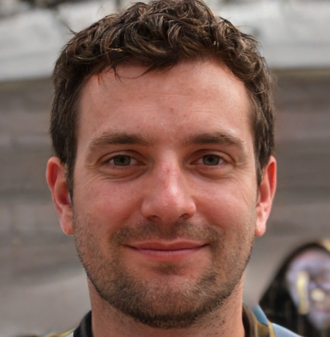
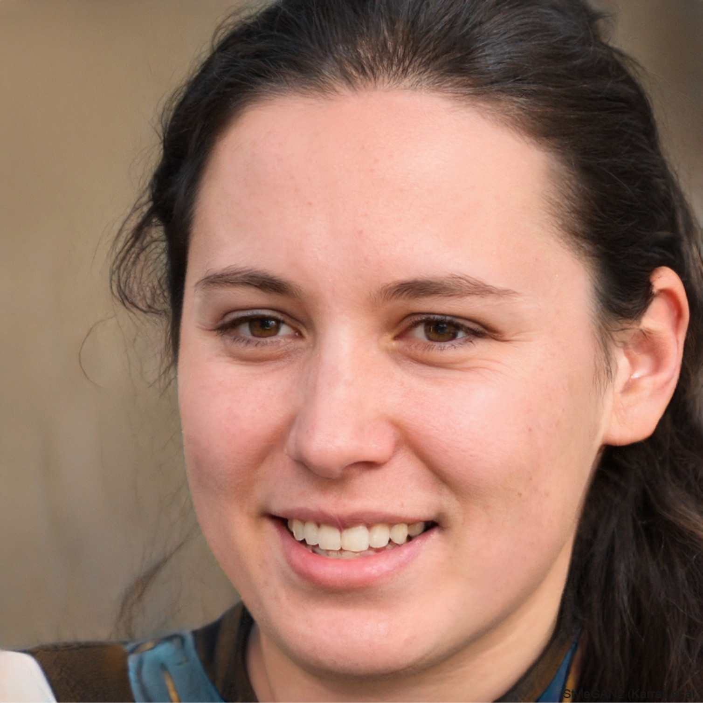

# Introdução

Para desenvolver um aplicativo eficaz, é crucial ter uma compreensão aprofundada dos usuários envolvidos. As personas desempenham um papel essencial nesse processo, capacitando as equipes de desenvolvimento a projetarem produtos que sejam precisamente adaptados às diversas necessidades e expectativas de cada segmento de usuários. Nesse documento iremos apresentar as personas usadas para o projeto de Requisitos de Software do aplicativo Sinesp Cidadão.

# Metodologia

Pra criar uma persona fizemos uma analise dos perfis de usuarios e com isso foi feito a modelagem das personas para se adequar ao projeto

# Elenco

A seguir são o elenco de personas do projeto

                                          

<b>Tabela 1</b> - Persona Primária Rogerio Barreto.

| 
Figura 1- Persona Primária Rogerio Barreto.
<figure markdown><figcaption>Fonte: Elaborada por [Christian](https://github.com/crstyhs) (2024).<a id="TEC2" href="#QT2">^2^</a></figcaption></figure> |
| ----------------------------------------------------------------------------------------------------------------------------------------------------------------------------------------------------------------------------------------------------------------------------------------------------------------------------------------------------------------------------------------- |
| **Nome**: Rogerio Barreto |
| **Status**: Persona Primária. |
| **Gênero**: Masculino. 
| **Idade**: 40 anos |
| **Profissão**: Aposentado (Ex-policial)|
| **Escolaridade**: Ensino superior completo. |
| **Habilidades e Experiências**:   Experiência em lidar com situações de segurança e aplicação da lei, habilidades em investigação e análise de informações. |
| **Relacionamento**:  Casado, com filhos adultos. Mantém um círculo social amplo, incluindo ex-colegas policiais e vizinhos.  |
| **Objetivo**: Utilizar o aplicativo SINESP Cidadão para acessar informações sobre veículos e ocorrências de trânsito, auxiliando na segurança pessoal e da comunidade.|
| **Expectativa**:   Espera que o aplicativo forneça informações precisas e atualizadas sobre veículos, permitindo-lhe verificar a procedência e situação de carros suspeitos ou envolvidos em atividades criminosas. Também espera acessar dados sobre ocorrências de trânsito para evitar áreas problemáticas e garantir uma condução segura.             |
| **Requisitos**: Interface intuitiva e fácil de usar, acesso rápido a dados precisos e confiáveis, atualizações frequentes para garantir informações em tempo real.                                                                                                                             |
| **Tarefas**:       Verificar a situação de veículos suspeitos antes de abordá-los, auxiliar amigos e familiares na verificação de informações veiculares quando necessário e verificar a situação das pessoas que conduzem os veículos.                                                                                                                                                                                               
<b>Tabela 2</b> - Persona Secundária Rogério Matos.
              |

Fonte: [Christian](https://github.com/crstyhs).

| 
Figura 2- Persona Primária Rafael Valério Silva.
<figure markdown><figcaption>Fonte: Elaborada por [Ian Lucca](https://github.com/IanLucca12) (2024).</figcaption></figure> |
| ----------------------------------------------------------------------------------------------------------------------------------------------------------------------------------------------------------------------------------------------------------------------------------------------------------------------------------------------------------------------------------------- |
| **Nome**: Rafael Valério Silva|
| **Status**: Persona Primária. |
| **Gênero**: Masculino. 
| **Idade**: 35 anos |
| **Profissão**: Agente de polícia civil|
| **Escolaridade**: Formado em direito pela Universidade de São Carlos (UFSCAR) |
| **Habilidades e Experiências**:  Rafael trabalha liderando as investigações e conduzindo o inquérito policial, além de decidir sobre prisões em flagrante, pedidos de mandados de busca e apreensão, e outras medidas judiciais essenciais à investigação criminal. |
| **Relacionamento**: Rafael é casado, possui dois gatos e gosta de jogar Magic the Gathering com os amigos nos fins de semana.  |
| **Objetivo**: Após diversos relatos sobre o crescente número de furto de veículos em sua cidade, o agente decidiu baixar o aplicativo para poder ter mais informações sobre os carros que ele pode encontrar em suas rondas e saber se eles são roubados.|
| **Expectativa**:   Rafael deseja que sua experiência com o aplicativo seja rápida e direto ao ponto, informações sobre a placa, cor e modelo do carro.            |
| **Requisitos**: Interface intuitiva e fácil de usar, acesso rápido a dados precisos e confiáveis, atualizações frequentes para garantir informações em tempo real.                                                                                                                             |
| **Tarefas**:      Rafael passa o dia cumprindo com seus afazeres como policial civil, quando ele trabalha em áreas de alta criminalidade ele quer saber se pode avistar um carro roubado. Mantém o aplicativo para ter acesso aos dados dentro dele e costuma usar.                                                                                                                                                                                                          |

Fonte: [Ian Lucca](https://github.com/IanLucca12).

<b>Tabela 3</b> - Persona Secundária Rogério Matos.

| 
Figura 3- Persona Primária Roberta do Santos.
<figure markdown><figcaption>Fonte: Elaborada por [Harryson Campos](https://github.com/harry-cmartin) (2024).</figcaption></figure> |
| ----------------------------------------------------------------------------------------------------------------------------------------------------------------------------------------------------------------------------------------------------------------------------------------------------------------------------------------------------------------------------------------- |
| **Nome**: Rogério Matos.                                                                                   |
| **Status**: Persona Secundária.                                                   |
| **Gênero**: Masculino.                                                                                                              |
| **Idade**: 40 anos.                                                              |
| **Profissão**: Procurador.                                                                          |
| **Escolaridade**: Pós-Graduação em Direito.                                                                          |
| **Habilidades e Experiências**: Conhecimento em Direito civil, penal, constitucional, e administrativo.                                                                                          |
| **Relacionamento**: Equipe de trabalho, familiares e amigos.                                                                                        |
| **Objetivo**: COmo rogério trabalha como procurador, não tiliza frequentemente o app, procurando-o somente quando precisa fazer denúncias sobre irregularidades encontradas ou pesquisas de procurados.                                        |
| **Expectativa**: Rogério geralnmente trabalha toda a semana e é muito dedicado a seu trabalho, não gosta de encontrar violações a leis e não denuncia-las, logo quando encontra tais ireegularidades em seu trabalho, abre o app e denuncia.                                            |
| **Requisitos**: Após a descoberta de irregularidades a pessoa faz a denúncia.                                   |
| **Tarefas**: Ir para o trabalho de manhã, trabalhar até de tarde, voltar para casa e curtir a sua família.                       |

Fonte: [Harryson Campos](https://github.com/harry-cmartin).

<b>Tabela 4</b> - Persona Secundária Camila Rodrigues.

 
| 
Figura 4 Persona Secundária Camila Rodrigues.
<figure markdown><figcaption>Fonte: Elaborada por [Flávio Melo](https://github.com/flavioovatsug).
 (2024).<a id="TEC2" href="#QT2">^2^</a></figcaption></figure> |
| ----------------------------------------------------------------------------------------------------------------------------------------------------------------------------------------------------------------------------------------------------------------------------------------------------------------------------------------------------------------------------------------- |
| Nome: Camila Rodrigues.                                                                                                                                                                                                                                                                                                                                                              |
| Status: Persona Secundária.                                                                                                                                                                                                                                                                                                                                                             |
| Gênero: Feminino.                                                                                                                                                                                                                                                                                                                                                                     |
| Idade: 40 anos.                                                                                                                                                                                                                                                                                                                                                                       |
| Profissão: Advogada.                                                                                                                                                                                                                                                                                                                               |
| Escolaridade: Graduada em Direito pela Universidade Federal do Rio de Janeiro (UFRJ).                                                                                                                                                                                                                                                                                                                                 |
| Habilidades e Experiências: Camila é uma advogada especializada em direito penal e direitos humanos. Ela possui uma sólida experiência em lidar com casos delicados, como desaparecimentos de pessoas e violência doméstica.                                                                                                                                                                                                                                                                                              |
| Relacionamento: Camila é solteira e tem uma vida social ativa, mas sua paixão pelo trabalho muitas vezes a mantém ocupada fora do horário comercial. Ela tem uma relação próxima com sua família e dedica parte de seu tempo livre para atividades voluntárias em organizações que lutam pelos direitos humanos.                                        |
| Objetivo: Camila busca proporcionar justiça e proteção legal para os mais vulneráveis da sociedade.                                        |
| Expectativa: Obter todas as informações de pessoas desaparecidas para facilitar a localização.                                           |
| Requisitos: Acesso ao aplicativo SINESP Cidadão para consultar informações sobre pessoas desaparecidas e realizar buscas quando necessário.                                                                                                                                                                                                                                                  |
| Tarefas: Camila utiliza o aplicativo SINESP Cidadão de forma esporádica para auxiliar na localização de pessoas desaparecidas entre seus clientes. Ela verifica informações sobre registros de ocorrências policiais, antecedentes criminais e outras informações relevantes para ajudar em suas investigações e fornecer apoio legal adequado aos seus clientes.                                                                                                                                                                                                                                   |
 

Fonte: [Flávio Melo](https://github.com/flavioovatsug).

<b>Tabela 5</b> - Anti-Persona Marina Silva.

| 
Figura 5- Anti-Persona Marina Silva.
<figure markdown><figcaption>Fonte: [Italo Bruno](https://github.com/italobrunom) (2024).<a id="TEC2" href="#QT2"> 2</a></figcaption></figure> |
| ----------------------------------------------------------------------------------------------------------------------------------------------------------------------------------------------------------------------------------------------------------------------------------------------------------------------------------------------------------------------------------------- |
| **Nome**: Marina Silva |
| **Status**: Anti-Persona. |
| **Gênero**: Feminino. 
| **Idade**: 9 anos |
| **Profissão**: Estudante escola primária|
| **Escolaridade**: Ensino Fundamental. |
| **Habilidades e Experiências**:   Marina foi criada com acessos a tecnologia tendo facilidade com o uso. |
| **Relacionamento**:  Vive com o pai e 1 irmão mais velho que trabalha já como desenvolvedor  |
| **Objetivo**: Marina usa o aplicativo para ajudar ao pai a colocar os dados do carro que foi roubado e o filho mais velho sumiu. |
| **Expectativa**: Marina espera poder usar com facilidade o aplicativo e colocar os dados rapidamente.                |
| **Requisitos**: Acompanhar os dados do sistema          |
| **Tarefas**: Marina passa o dia na escola e de noite fica com o pai estudando e se divertindo.               

## Histórico de Versões

| Versão | Data       | Descrição                           | Autor(es)                                                                                           | Revisor(es)                                      |
| ------ | ---------- | ----------------------------------- | --------------------------------------------------------------------------------------------------- | ------------------------------------------------ |
|1.0| 03/05 |   Criação do arquivo    | [Italo Bruno](https://github.com/ItalobrunoM) |  |
|1.1| 03/05 | Persona secundaria | [Harryson Campos](https://github.com/harry-cmartin) | |
|1.2| 03/05 |   Anti-Persona    | [Italo Bruno](https://github.com/ItalobrunoM) |  |
|1.3| 03/05 | Persona primaria | [Christian](https://github.com/crstyhs) | |
|1.4| 03/05 | Persona secundaria |[Ian Lucca](https://github.com/IanLucca12) | |
|1.5| 03/05 | Persona secundaria |[Flávio Melo](https://github.com/flavioovatsug) | |