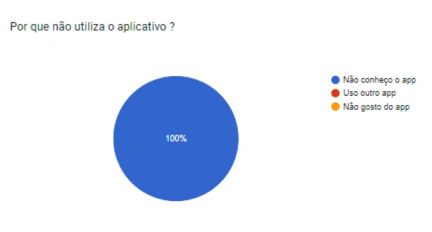
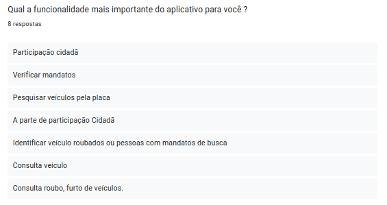
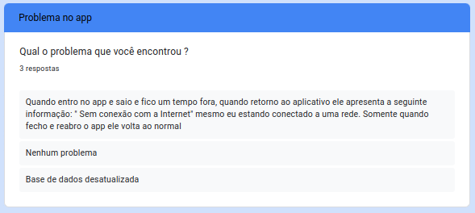

# Questionário

## Introdução

Um questiónario é uma forma eficiente e rápida de coletar dados qualitativos e quantitativos que ajudam a descrever situações e gerar resultados de um grupo de pessoas, analisando suas opiniões, expectativas e interesses em relação a um sistema.

## Metodologia

O questionário foi divulgado em grupos de WhatsApp e Telegram nos grupos da Universidade de Brasília, além de grupos de servidores públicos. Essa metodologia ajudará a coletar dados dos usuários mais comuns do aplicativo em estudo, facilitando o desenvolvimento do perfil de usuário e elicitação de novos requisitos.

## Resultados

Essa página apresenta os resultados da análise dos dados que o grupo coletou por meio de um questionário online, no qual foi exposto previamente um [termo de consentimento](../termo_consentimento.pdf), e preenchido pelos participantes online, as coletas podem ser vistas nas figuras de 1 a 13 abaixo:

Figura 1- Questão 1.

<iframe width="600" height="371" seamless frameborder="0" scrolling="no" src="https://docs.google.com/spreadsheets/d/e/2PACX-1vSqUV9lnhmvOQuF8w-JObzT3tKcqvHVNYcsuPLZz4OYQiuzCtwDRsFy7cs49S4ne3OSYlNxrZUPbCST/pubchart?oid=1587016036&amp;format=image"></iframe>

Fonte: [Harryson C. MArtins](https://github.com/harry-cmartin), 2024

Figura 2- Questão 2.

Fonte: [Harryson C. MArtins](https://github.com/harry-cmartin), 2024

Figura 3- Questão 3.

<iframe width="619" height="382" seamless frameborder="0" scrolling="no" src="https://docs.google.com/spreadsheets/d/e/2PACX-1vSqUV9lnhmvOQuF8w-JObzT3tKcqvHVNYcsuPLZz4OYQiuzCtwDRsFy7cs49S4ne3OSYlNxrZUPbCST/pubchart?oid=163440563&amp;format=image"></iframe>

Fonte: [Harryson C. Martins](https://github.com/harry-cmartin), 2024

Figura 4- Questão 4.

<iframe width="606" height="371" seamless frameborder="0" scrolling="no" src="https://docs.google.com/spreadsheets/d/e/2PACX-1vSqUV9lnhmvOQuF8w-JObzT3tKcqvHVNYcsuPLZz4OYQiuzCtwDRsFy7cs49S4ne3OSYlNxrZUPbCST/pubchart?oid=401567488&amp;format=image"></iframe>

Fonte: [Harryson C. MArtins](https://github.com/harry-cmartin), 2024

Figura 5- Questão 5.

<iframe width="746" height="371" seamless frameborder="0" scrolling="no" src="https://docs.google.com/spreadsheets/d/e/2PACX-1vSqUV9lnhmvOQuF8w-JObzT3tKcqvHVNYcsuPLZz4OYQiuzCtwDRsFy7cs49S4ne3OSYlNxrZUPbCST/pubchart?oid=2124519026&amp;format=image"></iframe>

Fonte: [Harryson C. MArtins](https://github.com/harry-cmartin), 2024

Figura 6- Questão 6.

<iframe width="600" height="371" seamless frameborder="0" scrolling="no" src="https://docs.google.com/spreadsheets/d/e/2PACX-1vSqUV9lnhmvOQuF8w-JObzT3tKcqvHVNYcsuPLZz4OYQiuzCtwDRsFy7cs49S4ne3OSYlNxrZUPbCST/pubchart?oid=1423880471&amp;format=image"></iframe>

Fonte: [Harryson C. MArtins](https://github.com/harry-cmartin), 2024

Figura 7- Questão 7.

<iframe width="600" height="371" seamless frameborder="0" scrolling="no" src="https://docs.google.com/spreadsheets/d/e/2PACX-1vSqUV9lnhmvOQuF8w-JObzT3tKcqvHVNYcsuPLZz4OYQiuzCtwDRsFy7cs49S4ne3OSYlNxrZUPbCST/pubchart?oid=916635872&amp;format=interactive"></iframe>

Fonte: [Harryson C. MArtins](https://github.com/harry-cmartin), 2024

Figura 8- Questão 8.

<iframe width="600" height="371" seamless frameborder="0" scrolling="no" src="https://docs.google.com/spreadsheets/d/e/2PACX-1vSqUV9lnhmvOQuF8w-JObzT3tKcqvHVNYcsuPLZz4OYQiuzCtwDRsFy7cs49S4ne3OSYlNxrZUPbCST/pubchart?oid=2103119317&amp;format=image"></iframe>

Fonte: [Harryson C. MArtins](https://github.com/harry-cmartin), 2024

Figura 9- Questão 9.

Fonte: [Harryson C. MArtins](https://github.com/harry-cmartin), 2024

Figura 10- Questão 10.

<iframe width="600" height="371" seamless frameborder="0" scrolling="no" src="https://docs.google.com/spreadsheets/d/e/2PACX-1vSqUV9lnhmvOQuF8w-JObzT3tKcqvHVNYcsuPLZz4OYQiuzCtwDRsFy7cs49S4ne3OSYlNxrZUPbCST/pubchart?oid=1625156782&amp;format=image"></iframe>

Fonte: [Harryson C. MArtins](https://github.com/harry-cmartin), 2024

Figura 11- Questão 11.

Fonte: [Harryson C. MArtins](https://github.com/harry-cmartin), 2024

Figura 12- Questão 12.

Fonte: [Harryson C. MArtins](https://github.com/harry-cmartin), 2024

Figura 13- Questão 13.

Fonte: [Harryson C. MArtins](https://github.com/harry-cmartin), 2024

## Bibliografia

> <a id="FRM1" href="#anchor_1">1.</a>BARBOSA, S. D. J.; SILVA, B. S. Interação Humano-Computador. Rio de Janeiro: Elsevier, 2011.

## Histórico de Versões

| Versão | Data       | Descrição         | Autor(es)                                                                                     | Revisor(es)                                      |
| ------ | ---------- | ----------------- | --------------------------------------------------------------------------------------------- | ------------------------------------------------ |
| `1.0`    | 14/04 | Criação da página | [Harryson C. Martins](https://github.com/harry-cmartin)| [Christian](https://github.com/crstyhs) |
| `1.1`    | 16/04 | Adição dos dados | [Harryson C. Martins](https://github.com/harry-cmartin)| [Flávio Gustavo](https://github.com/flavioovatsug) |
